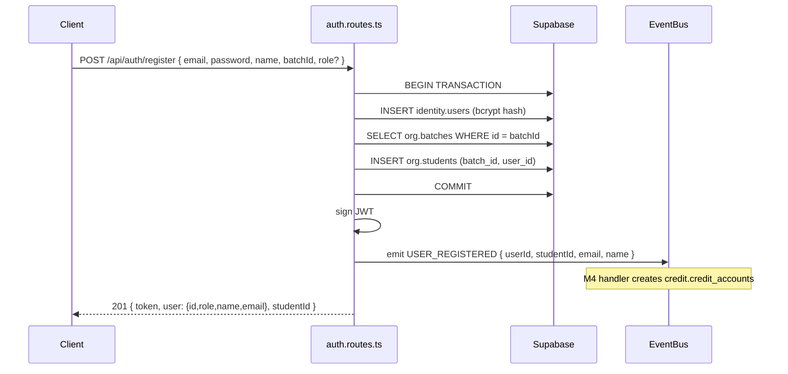
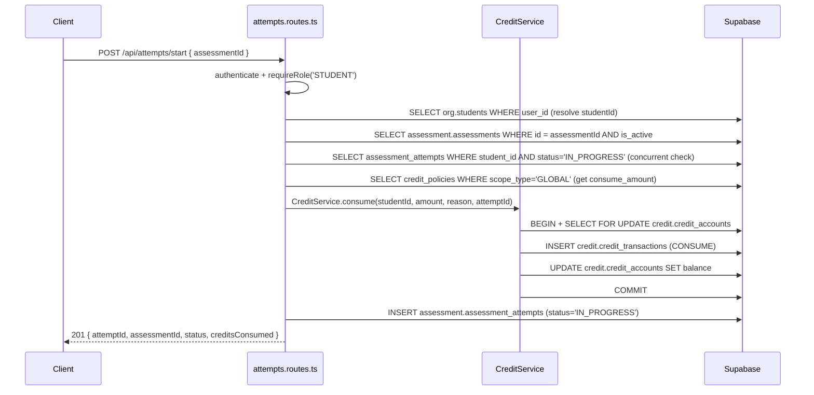
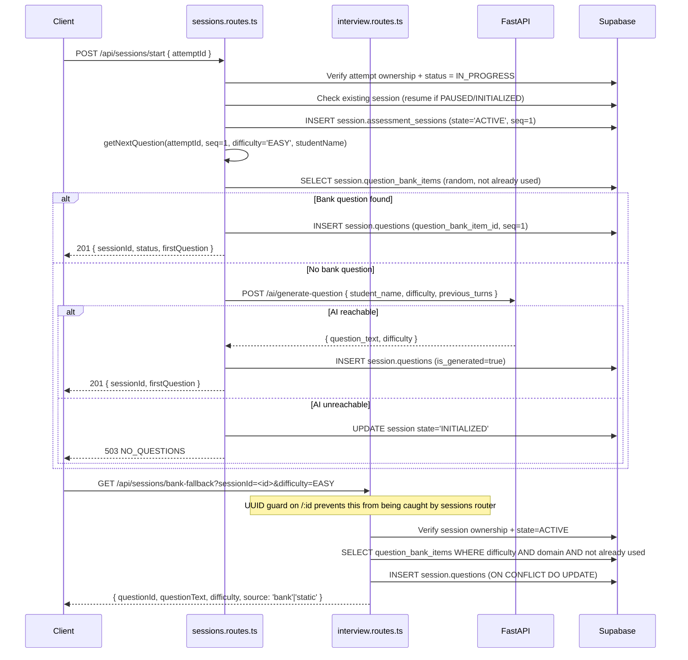
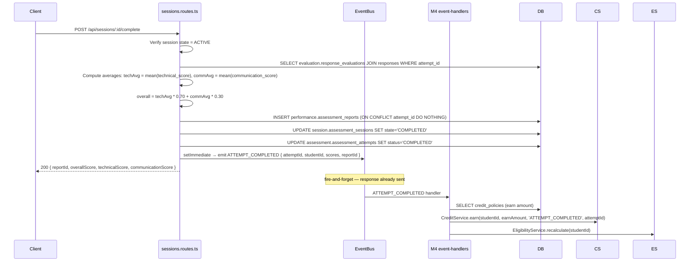
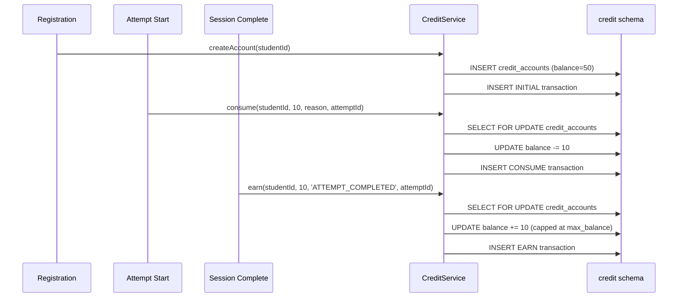
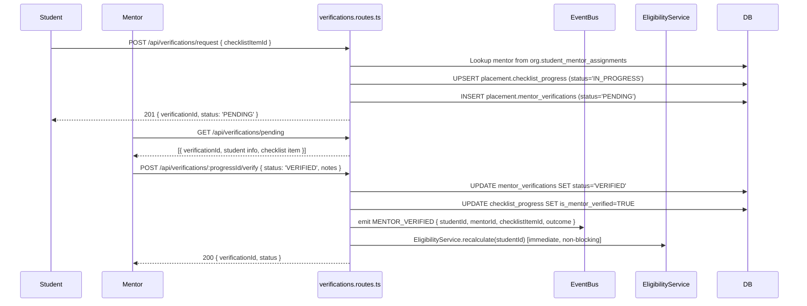
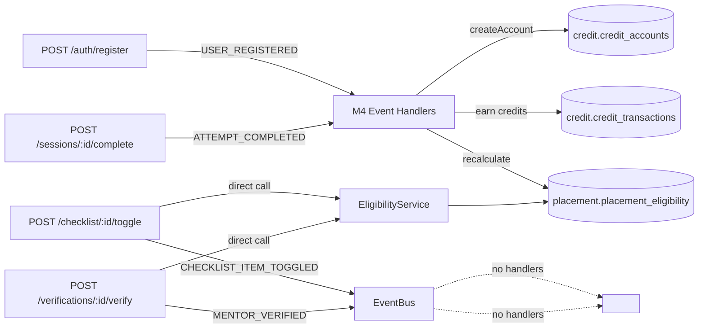
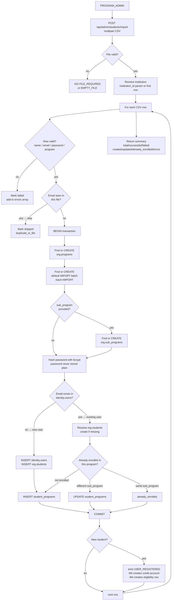
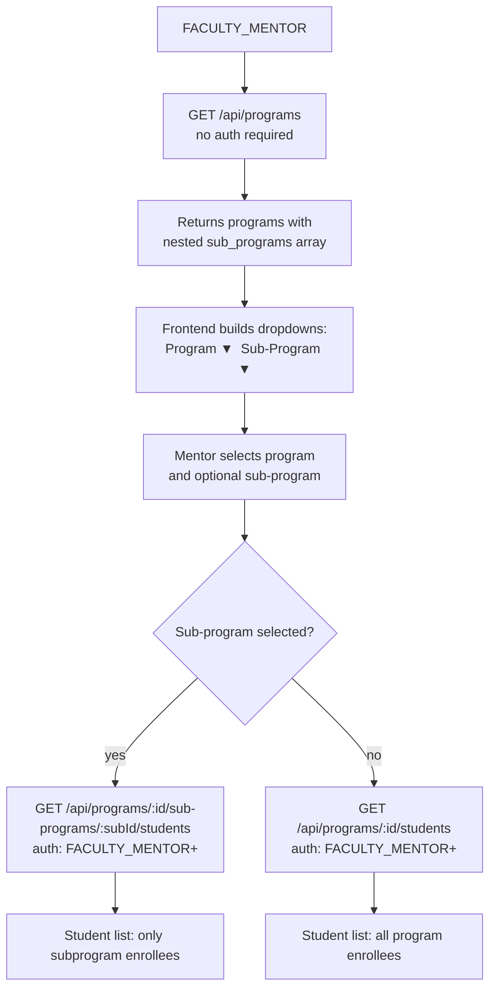
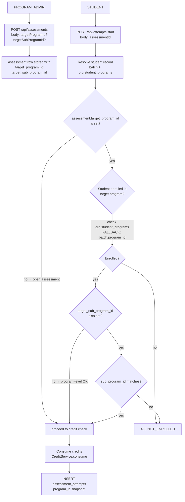

# API Data Flow Architecture

> **Branch:** `feature/api-data-flow-architecture`
> **Generated:** 2026-09-28
> **Status:** Authoritative reference — update whenever routes, schemas, events, or ownership changes.

This document is the project's authoritative reference for every API-to-API interaction, module-to-module dependency, database ownership boundary, event flow, AI service integration, and frontend↔backend relationship in the Communication Readiness Platform.

---

## Table of Contents

1. [Platform Architecture Overview](#1-platform-architecture-overview)
2. [Service Topology](#2-service-topology)
3. [Database Schema Ownership](#3-database-schema-ownership)
4. [API Endpoint Registry](#4-api-endpoint-registry)
5. [Authentication & Authorization Flow](#5-authentication--authorization-flow)
6. [Module 1 — Identity, Org & User Management](#6-module-1--identity-org--user-management)
7. [Module 2 — Assessment Lifecycle](#7-module-2--assessment-lifecycle)
8. [Module 2 — Session & Question Flow](#8-module-2--session--question-flow)
9. [Module 2 — Response Submission & Evaluation](#9-module-2--response-submission--evaluation)
10. [AI Service Integration](#10-ai-service-integration)
11. [Module 4 — Credit System](#11-module-4--credit-system)
12. [Module 4 — Checklist & Mentor Verification](#12-module-4--checklist--mentor-verification)
13. [Module 4 — Placement Eligibility](#13-module-4--placement-eligibility)
14. [Event Architecture](#14-event-architecture)
15. [Cross-Module Contracts](#15-cross-module-contracts)
16. [Frontend ↔ Backend Relationship](#16-frontend--backend-relationship)
17. [Environment Configuration](#17-environment-configuration)

---

## 1. Platform Architecture Overview

```
┌─────────────────────────────────────────────────────────────────┐
│                 Communication Readiness Platform                 │
│                                                                  │
│  ┌──────────────┐   HTTP/REST    ┌─────────────────────────┐   │
│  │   Frontend   │ ─────────────▶ │   Express Backend        │   │
│  │ React 19     │  (future;      │   TypeScript + Node.js   │   │
│  │ Vite + TW    │  currently     │   Port: env.PORT (5000)  │   │
│  │ localStorage │  mocked)       │                          │   │
│  └──────────────┘                │   ┌──────────────────┐  │   │
│                                  │   │   In-Process      │  │   │
│  ┌──────────────┐   HTTP         │   │   EventBus        │  │   │
│  │  AI Service  │ ◀────────────  │   │   (EventEmitter)  │  │   │
│  │  FastAPI     │   (axios)      │   └──────────────────┘  │   │
│  │  Port: 8000  │                │                          │   │
│  └──────────────┘                │   ┌──────────────────┐  │   │
│                                  │   │ Redis (optional)  │  │   │
│  ┌──────────────┐   pg driver    │   │ ioredis + noop   │  │   │
│  │  Supabase    │ ◀────────────  │   └──────────────────┘  │   │
│  │  PostgreSQL  │                └─────────────────────────┘   │
│  │  (SSL/TLS)   │                                               │
│  └──────────────┘                                               │
└─────────────────────────────────────────────────────────────────┘
```

The backend is the **single authoritative service**. The frontend is deliberately decoupled (100% mocked). The AI service is an optional accelerator with graceful degradation when unreachable.

---

## 2. Service Topology

| Service | Technology | Port | Role |
|---------|-----------|------|------|
| Express Backend | TypeScript, Node.js, Express 4 | `env.PORT` (default 5000) | All business logic, CRUD, auth, event dispatch |
| AI Service | FastAPI (Python) | 8000 | Audio transcription + response evaluation |
| Supabase PostgreSQL | PostgreSQL 15 + pgvector | Supabase cloud | Persistent data store |
| Redis | ioredis | `env.REDIS_URL` (optional) | Session context cache (turn transcripts) |
| Frontend | React 19, Vite, Tailwind | 5173 (dev) | UI — currently 100% mocked, no real backend calls |

### Backend Module Map

```
backend/src/
├── index.ts                      ← Server entry: registers routes + M4 event handlers
├── config/env.ts                 ← Zod-validated env vars
├── middleware/
│   ├── authenticate.ts           ← JWT verify + token_version DB check
│   └── authorize.ts              ← requireRole() + requireStudentSelfOrStaff()
├── routes/
│   ├── index.ts                  ← All route mounts
│   ├── auth.routes.ts            ← M1 auth (register/login/logout/me)
│   └── interview.routes.ts       ← M1 audio (bank-fallback + turns)
└── modules/
    ├── assessments/              ← M2
    ├── attempts/                 ← M2
    ├── sessions/                 ← M2
    ├── responses/                ← M2
    ├── reports/                  ← M2
    ├── question-bank/            ← M2
    ├── evaluation/               ← M2 (ai-client + scoring helpers)
    ├── credits/                  ← M4 (routes + service + event-handlers)
    ├── checklist/                ← M4
    ├── verifications/            ← M4
    └── placement/                ← M4 (routes + eligibility service)
```

---

## 3. Database Schema Ownership

Each schema is owned by one module. Cross-module reads are allowed; cross-module writes go through the owning module's service layer.

| PostgreSQL Schema | Owner Module | Tables |
|-------------------|-------------|--------|
| `identity` | M1 | `users` |
| `org` | M1 | `institutions`, `programs`, `batches`, `subdivisions`, `students`, `student_mentor_assignments`, `trainer_subdivision_assignments` |
| `session` | M2 | `assessment_sessions`, `questions`, `question_bank_items`, `question_bank_item_skills`, `interview_transcripts` |
| `assessment` | M2 | `assessments`, `assessment_components`, `assessment_attempts` |
| `evaluation` | M2 | `responses`, `response_evaluations`, `ai_runs` |
| `performance` | M2/M3 | `assessment_reports` (written by M2), `performance_profiles` (owned by M3, read by M4) |
| `credit` | M4 | `credit_accounts`, `credit_transactions`, `credit_policies` |
| `placement` | M4 | `checklist_items`, `checklist_progress`, `mentor_verifications`, `placement_eligibility` |
| `system` | Cross | `migrations`, `audit_logs` |

### Schema Dependency Diagram

```
identity.users ──────────────────────────────────────────────────────┐
      │                                                               │
      │ 1:1                                                          │
      ▼                                                               │
org.students ──────────── assessment.assessment_attempts             │
      │                             │                                 │
      │ FK                          │ FK                              │
      ▼                             ▼                                 │
session.assessment_sessions ── evaluation.responses                  │
      │                             │                                 │
      │                             ▼                                 │
session.questions ──────── evaluation.response_evaluations           │
      │                             │                                 │
      │                             │ aggregated by                  │
session.question_bank_items         ▼                                 │
                        performance.assessment_reports                │
                                    │                                 │
credit.credit_accounts ─────────────┤ M4 reads from M2+M3           │
placement.checklist_items ──────────┤                                │
placement.placement_eligibility ◀───┘                                │
```

---

## 4. API Endpoint Registry

Base path: `/api`

### M1 — Auth

| Method | Path | Auth | Role(s) | Description |
|--------|------|------|---------|-------------|
| POST | `/auth/register` | None | — | Create user + student + emit USER_REGISTERED |
| POST | `/auth/login` | None | — | Validate credentials, return JWT |
| POST | `/auth/logout` | JWT | Any | Increment token_version (revoke token) |
| GET | `/auth/me` | JWT | Any | Return current user + studentId |

### M1 — Org

| Method | Path | Auth | Role(s) | Description |
|--------|------|------|---------|-------------|
| GET | `/org/institutions` | None | — | List institutions |
| GET | `/org/programs` | None | — | List programs |
| GET | `/org/batches` | None | — | List batches |
| GET | `/org/subdivisions` | None | — | List subdivisions |
| GET | `/students/:studentId` | JWT | Any | Get student profile (self only for STUDENT) |
| PATCH | `/students/:studentId` | JWT | STUDENT (self) | Update coding handles |
| GET | `/admin/users` | JWT | PROGRAM_ADMIN | List users |
| PATCH | `/admin/users/:id/role` | JWT | PROGRAM_ADMIN | Change user role (cannot grant PROGRAM_ADMIN) |
| PATCH | `/admin/users/:id/status` | JWT | PROGRAM_ADMIN | Activate/suspend user |
| POST | `/mentors/assign` | JWT | PROGRAM_ADMIN | Assign mentor to student |
| GET | `/mentors/my-students` | JWT | FACULTY_MENTOR | List assigned students |
| POST | `/trainers/assign` | JWT | PROGRAM_ADMIN | Assign trainer to subdivision |
| GET | `/trainers/my-subdivisions` | JWT | TRAINER | List assigned subdivisions |

### M1 — Audio / Interview

| Method | Path | Auth | Role(s) | Description |
|--------|------|------|---------|-------------|
| GET | `/sessions/bank-fallback` | JWT | STUDENT | Fetch next question from bank (or static fallback) |
| POST | `/sessions/:id/turns` | JWT | STUDENT | Submit audio turn (multipart) → FastAPI evaluation |

### M2 — Assessments

| Method | Path | Auth | Role(s) | Description |
|--------|------|------|---------|-------------|
| GET | `/assessments` | JWT | Any | List active assessments |
| POST | `/assessments` | JWT | PROGRAM_ADMIN | Create assessment |
| GET | `/assessments/:id` | JWT | Any | Get assessment + components |
| PUT | `/assessments/:id` | JWT | PROGRAM_ADMIN | Update assessment |

### M2 — Attempts

| Method | Path | Auth | Role(s) | Description |
|--------|------|------|---------|-------------|
| POST | `/attempts/start` | JWT | STUDENT | Start attempt (consume credits) |
| GET | `/attempts/:id` | JWT | STUDENT (own) | Get attempt details |
| PUT | `/attempts/:id/abandon` | JWT | STUDENT (own) | Abandon attempt |

### M2 — Sessions

| Method | Path | Auth | Role(s) | Description |
|--------|------|------|---------|-------------|
| POST | `/sessions/start` | JWT | STUDENT | Start/resume session (creates first question) |
| GET | `/sessions/:id` | JWT | STUDENT (own) | Get session + current question |
| POST | `/sessions/:id/proctor-event` | JWT | STUDENT | Report TAB_SWITCH/FOCUS_LOST |
| POST | `/sessions/:id/complete` | JWT | STUDENT | Complete session → create report → emit ATTEMPT_COMPLETED |

### M2 — Responses & Reports

| Method | Path | Auth | Role(s) | Description |
|--------|------|------|---------|-------------|
| POST | `/responses/submit` | JWT | STUDENT | Submit text response → FastAPI eval → next question |
| GET | `/responses/:id` | JWT | STUDENT (own) / FACULTY_MENTOR (assigned) | Get response + evaluation |
| GET | `/reports/:attemptId` | JWT | STUDENT (own) / FACULTY_MENTOR (assigned) | Get full assessment report |

### M2 — Question Bank

| Method | Path | Auth | Role(s) | Description |
|--------|------|------|---------|-------------|
| GET | `/question-bank` | JWT | FACULTY_MENTOR, TRAINER, PROGRAM_ADMIN, PLACEMENT_COORDINATOR | List active questions |
| POST | `/question-bank` | JWT | FACULTY_MENTOR, TRAINER, PROGRAM_ADMIN | Create question |
| PUT | `/question-bank/:id` | JWT | FACULTY_MENTOR, TRAINER, PROGRAM_ADMIN | Update question |
| DELETE | `/question-bank/:id` | JWT | PROGRAM_ADMIN, PLACEMENT_COORDINATOR | Soft-delete question |

### M4 — Credits

| Method | Path | Auth | Role(s) | Description |
|--------|------|------|---------|-------------|
| GET | `/credits/balance/:studentId` | JWT | STUDENT (own) / Any admin | Get credit balance + totals |
| GET | `/credits/transactions/:studentId` | JWT | STUDENT (own) / Any admin | List transactions (paginated) |
| POST | `/credits/adjust` | JWT | PLACEMENT_COORDINATOR | Manual credit adjustment |

### M4 — Credit Policies

| Method | Path | Auth | Role(s) | Description |
|--------|------|------|---------|-------------|
| GET | `/credit-policies` | JWT | PROGRAM_ADMIN | List policies |
| POST | `/credit-policies` | JWT | PLACEMENT_COORDINATOR | Create policy |
| PUT | `/credit-policies/:id` | JWT | PLACEMENT_COORDINATOR | Update policy |

### M4 — Checklist

| Method | Path | Auth | Role(s) | Description |
|--------|------|------|---------|-------------|
| GET | `/checklist` | JWT | Any | List checklist items |
| POST | `/checklist` | JWT | PLACEMENT_COORDINATOR | Create item |
| POST | `/checklist/import-csv` | JWT | PLACEMENT_COORDINATOR | Bulk import items |
| PUT | `/checklist/:id` | JWT | PLACEMENT_COORDINATOR | Update item |
| DELETE | `/checklist/:id` | JWT | PLACEMENT_COORDINATOR | Soft-delete item |
| GET | `/checklist/my-progress` | JWT | STUDENT | Get own checklist progress |
| POST | `/checklist/:itemId/toggle` | JWT | STUDENT | Mark item complete/incomplete |
| GET | `/checklist/mentee/:studentId` | JWT | FACULTY_MENTOR (assigned) | View mentee checklist |

### M4 — Verifications

| Method | Path | Auth | Role(s) | Description |
|--------|------|------|---------|-------------|
| GET | `/verifications/pending` | JWT | FACULTY_MENTOR | List pending verifications |
| POST | `/verifications/request` | JWT | STUDENT | Request mentor verification |
| POST | `/verifications/:progressId/verify` | JWT | FACULTY_MENTOR (assigned) | Verify/reject checklist item |

### M4 — Placement Eligibility

| Method | Path | Auth | Role(s) | Description |
|--------|------|------|---------|-------------|
| GET | `/placement-eligibility/report` | JWT | PLACEMENT_COORDINATOR, PROGRAM_ADMIN | Paginated eligibility report |
| GET | `/placement-eligibility/:studentId` | JWT | STUDENT (own) / any admin | Get eligibility (auto-calculates on first access) |
| POST | `/placement-eligibility/:studentId/recalculate` | JWT | PLACEMENT_COORDINATOR, PROGRAM_ADMIN, FACULTY_MENTOR | Force recalculation |

---

## 5. Authentication & Authorization Flow

### JWT Lifecycle

```
POST /api/auth/register
  → bcrypt hash password
  → BEGIN TRANSACTION
     INSERT identity.users
     INSERT org.students
     INSERT credit.credit_accounts (via USER_REGISTERED event)
  → COMMIT
  → sign JWT { id, role, token_version: 0 }
  → emit USER_REGISTERED → M4 creates credit account
  → return { token, user, studentId }

POST /api/auth/login
  → SELECT identity.users WHERE email
  → bcrypt.compare(password, hash)
  → SELECT org.students WHERE user_id (for STUDENT role → include studentId)
  → sign JWT { id, role, token_version }
  → return { token, user, studentId }

POST /api/auth/logout
  → UPDATE identity.users SET token_version = token_version + 1
  → all existing tokens for this user become invalid on next verify
```

### authenticate Middleware

```
Request → authenticate middleware
  1. Extract Authorization: Bearer <token>
  2. jwt.verify(token, JWT_SECRET)  ← synchronous, fast
  3. SELECT id, role, status, token_version FROM identity.users WHERE id = payload.id
  4. Compare token.token_version === db.token_version  ← revocation check
  5. Check user.status === 'ACTIVE'
  6. Attach req.user = { id, role, token_version }
  → next()  OR  throw 401/403
```

### Role Hierarchy

```
SUPER_ADMIN
  └── PROGRAM_ADMIN         (manage users, assessments, question bank)
       └── PLACEMENT_COORDINATOR  (credits, checklist, policies)
            └── FACULTY_MENTOR    (mentor verifications, question bank read)
                 └── TRAINER      (question bank read)
                      └── STUDENT (take assessments, own data only)
```

### Authorization Helpers

| Helper | File | Logic |
|--------|------|-------|
| `requireRole(...roles)` | `middleware/authorize.ts` | req.user.role must be in roles list |
| `requireStudentSelfOrStaff()` | `middleware/authorize.ts` | STUDENT must match :studentId param; non-STUDENT passes through |

---

## 6. Module 1 — Identity, Org & User Management

### Registration Data Flow



### Mentor Assignment Flow

```
POST /api/mentors/assign
  → Verify requester is PROGRAM_ADMIN
  → Verify student exists (org.students)
  → Verify mentor has role FACULTY_MENTOR (identity.users)
  → INSERT org.student_mentor_assignments { student_id, mentor_id }
  → 201

GET /api/checklist/mentee/:studentId (FACULTY_MENTOR)
  → Verify SELECT FROM org.student_mentor_assignments WHERE student_id AND mentor_id AND is_active
  → If not assigned: 403
```

---

## 7. Module 2 — Assessment Lifecycle

### Attempt Start Flow



### Attempt Lifecycle States

```
IN_PROGRESS → COMPLETED   (via POST /sessions/:id/complete)
IN_PROGRESS → ABANDONED   (via PUT /attempts/:id/abandon OR session proctoring TERMINATED)
```

---

## 8. Module 2 — Session & Question Flow

### Session Start + Question Selection



### Proctoring Flow

```
POST /api/sessions/:id/proctor-event { eventType: 'TAB_SWITCH' | 'FOCUS_LOST' }

State machine in state_data JSONB:
  tab_switch_count += 1
  if tab_switch_count >= MAX_TAB_SWITCH_LIMIT (default 5):
    is_proctor_flagged = true
  if tab_switch_count > MAX_TAB_SWITCH_LIMIT + 1:
    session.state = 'TERMINATED'
    attempt.status = 'ABANDONED'  ← cascade abandon

  if 3 <= switches <= 4:
    INSERT system.audit_logs (PROCTORING_WARNING)
```

### Session Complete → Report Generation



---

## 9. Module 2 — Response Submission & Evaluation

There are **two response submission paths** depending on input type:

### Path A — Text Response (POST /api/responses/submit)

```
Client → POST /api/responses/submit
  { attemptId, questionId, transcript, inputType: 'TEXT' }

  1. Verify attempt ownership + IN_PROGRESS
  2. Verify question belongs to attempt (session.questions)
  3. Verify session is ACTIVE
  4. Idempotency guard (evaluation.responses WHERE idempotency_key)
  5. INSERT evaluation.responses
  6. INSERT evaluation.ai_runs (status='PENDING')
  7. Call evaluateResponse() → POST AI_SERVICE_URL/ai/evaluate-turn
     { question_text, student_answer, difficulty, turn_number }
  8. Normalize scores: score × 10 → clamped 0–100
  9. UPDATE evaluation.ai_runs (status='COMPLETED', latency_ms, model)
  10. INSERT evaluation.response_evaluations
  11. Determine next difficulty (adaptive):
      ≥80 → harder, <50 → easier
  12. SELECT next question from bank OR skip
  13. INSERT session.questions for next seq
  14. UPDATE session.assessment_sessions SET current_sequence_no
  → return { evaluationId, technicalScore, communicationScore, feedback, nextQuestion }
```

### Path B — Audio Response (POST /api/sessions/:id/turns)

```
Client → POST /api/sessions/:id/turns (multipart: audio file + metadata JSON)
  { turn_number, question_id?, idempotency_key? }

  1. authenticate (before multer — auth from JWT, not body)
  2. Verify session ownership + ACTIVE
  3. Resolve questionId from metadata or session.questions WHERE sequence_no
  4. Idempotency guard
  5. Forward audio → axios POST AI_SERVICE_URL/ai/evaluate-response (FormData)
     with 60s timeout
  6. Normalize: techScore = min(100, max(0, round(raw * 10 * 100) / 100))
  7. INSERT evaluation.responses (input_type='VOICE')
  8. INSERT evaluation.ai_runs
  9. INSERT evaluation.response_evaluations (only if AI reachable)
  10. INSERT session.interview_transcripts (catch: non-fatal if table missing)
  11. sessionContextService.cacheTurn() → Redis (non-fatal if Redis down)
  12. UPDATE session.assessment_sessions SET current_sequence_no = turn_number
  → return { responseId, transcript, technicalScore, communicationScore, aiReachable }
```

### Score Normalization

```
FastAPI returns:  technical_score = 7.5  (0–10 scale)
Backend applies:  Math.min(100, Math.max(0, Math.round(7.5 * 10 * 100) / 100))
Result:           75.00  (0–100 scale)

Final report overall score:
  overall = techAvg * 0.70 + commAvg * 0.30
```

---

## 10. AI Service Integration

### Endpoints Called by Backend

| Backend Caller | HTTP Method | AI Endpoint | Purpose |
|---------------|-------------|-------------|---------|
| `sessions.routes.ts` → `getNextQuestion()` | POST | `/ai/generate-question` | Generate AI question when bank is empty |
| `interview.routes.ts` → turns | POST | `/ai/evaluate-response` | Transcribe + evaluate audio turn |
| `responses.routes.ts` → `evaluateResponse()` | POST | `/ai/evaluate-turn` | Evaluate text response |

### ai-client.ts Contract

```typescript
// Input to FastAPI
interface AIEvaluateRequest {
  question_text: string;
  student_answer: string;
  difficulty: 'EASY' | 'MEDIUM' | 'ADVANCED';
  turn_number?: number;
  domain?: string;
}

// FastAPI response (raw 0–10 scale)
// ai-client normalizes to 0–100 before returning:
interface AIEvaluateResponse {
  technical_score: number;      // normalized 0–100
  communication_score: number;  // normalized 0–100
  wpm: number;
  filler_count: number;         // mapped from FastAPI's filler_words
  feedback: string;
  strengths: string;
  weaknesses: string;
  next_recommended_difficulty: string;
  model_used: string;
  latency_ms: number;
}
```

### Graceful Degradation

```
AI service unreachable →
  evaluateResponse() catches network error → returns { unreachable: true, all zeros }
  generateQuestion() catches network error → returns { unreachable: true, question_text: '' }

  responses.routes.ts: returns HTTP 503 AI_UNAVAILABLE, responseId saved (PENDING)
  sessions.routes.ts:  sets session state='INITIALIZED', returns 503 NO_QUESTIONS
  interview.routes.ts: writes response/ai_run rows with scores=0, aiReachable:false in response
```

### AI Service Configuration

```
env.AI_SERVICE_URL = process.env.AI_SERVICE_URL ?? 'http://127.0.0.1:8000'
axios client: baseURL = AI_SERVICE_URL, timeout = 30_000ms (60_000ms for audio)
```

---

## 11. Module 4 — Credit System

### CreditService Architecture

```
CreditService (credits.service.ts)
  ├── consume(studentId, amount, reason, referenceId)
  │     SELECT FOR UPDATE credit.credit_accounts (prevent double-spend)
  │     idempotency guard → credit.credit_transactions WHERE idempotency_key
  │     Throw 402 INSUFFICIENT_CREDITS if balance < amount
  │     UPDATE balance, INSERT CONSUME transaction
  │
  ├── earn(studentId, amount, reason, referenceId)
  │     SELECT FOR UPDATE credit.credit_accounts
  │     idempotency guard
  │     Fetch max_balance from credit_policies (GLOBAL, active)
  │     newBalance = min(current + amount, maxBalance)
  │     UPDATE balance, INSERT EARN transaction
  │
  └── createAccount(studentId)
        Called by USER_REGISTERED handler
        Fetch initial_credit_amount from credit_policies (default 50 if none)
        INSERT credit.credit_accounts + INITIAL transaction

ikey() helper:
  Keys ≤100 chars: used as-is (VARCHAR(100) constraint)
  Keys >100 chars: SHA-256 hash, truncated to 100 hex chars
```

### Credit Flow Diagram



### Credit Policy

| Policy Field | Purpose |
|---|---|
| `scope_type` | `'GLOBAL'` or assessment-specific |
| `initial_credit_amount` | Starting balance for new students (default 50) |
| `consume_amount` | Credits deducted per attempt start |
| `max_balance` | Upper cap on credit balance (NULL = no cap) |

---

## 12. Module 4 — Checklist & Mentor Verification

### Checklist Progress State Machine

```
checklist_progress.status:
  PENDING → IN_PROGRESS → COMPLETED
                 ▲              │
                 └──────────────┘ (can toggle back)

is_mentor_verified:
  false → true (only when mentor runs /verify with status='VERIFIED')
  true → false (when student un-completes: status != 'COMPLETED')
```

### Verification Flow



---

## 13. Module 4 — Placement Eligibility

### Eligibility Calculation

`EligibilityService.recalculate(studentId)` — called from three triggers:

| Trigger | Source |
|---------|--------|
| ATTEMPT_COMPLETED event | M4 event-handlers.ts |
| Checklist item toggle | checklist.routes.ts (fire-and-forget) |
| MENTOR_VERIFIED event | verifications.routes.ts (immediate) |
| On-demand GET | placement.routes.ts (if no record exists) |
| Manual recalculate | POST /placement-eligibility/:studentId/recalculate |

### Eligibility Criteria

```
Blocking conditions (any one → isEligible = false):
  1. required_checklist_verified < required_checklist_total
     (counts placement.checklist_items WHERE is_required=TRUE,
      joined with checklist_progress WHERE is_mentor_verified=TRUE)
  2. performance.performance_profiles.overall_score < 60.0
     (M3-owned table; M4 reads cross-schema)
  3. credit.credit_accounts.balance <= 0

threshold_score = max_score * 0.75  (NULL if max_score = 0)
```

---

## 14. Event Architecture

### Event Bus

```typescript
// shared/events/eventBus.ts
const eventBus = new EventEmitter();
eventBus.setMaxListeners(20);  // supports multiple handlers per event
export { eventBus };
```

The EventBus is **in-process** (Node.js EventEmitter), not distributed. Events are lost on process restart. All handlers are registered at server startup via `registerM4EventHandlers()`.

### Events Registry

| Event | Payload | Publisher | Subscribers |
|-------|---------|-----------|-------------|
| `USER_REGISTERED` | `{ userId, studentId, email, name }` | `auth.routes.ts` (register) | M4: `CreditService.createAccount()` |
| `ATTEMPT_COMPLETED` | `{ attemptId, assessmentId, studentId, assessmentType, technicalScore, communicationScore, overallScore, reportId }` | `sessions.routes.ts` (complete) | M4: `CreditService.earn()` + `EligibilityService.recalculate()` |
| `CHECKLIST_ITEM_TOGGLED` | `{ studentId, itemId, isCompleted, toggledBy }` | `checklist.routes.ts` (toggle) | No registered handlers (reserved for future notifications) |
| `MENTOR_VERIFIED` | `{ studentId, mentorId, verifiedAt, checklistItemId, outcome }` | `verifications.routes.ts` (verify) | No registered handlers (eligibility recalculated synchronously) |

### Event Flow Diagram



### Event Handler Registration

```typescript
// index.ts (server startup)
import { registerM4EventHandlers } from './modules/credits/event-handlers';
registerM4EventHandlers();  // must run before first request
```

---

## 15. Cross-Module Contracts

### M1 → M2 (Auth provides identity context)

| Data | From | To | How |
|------|------|-----|-----|
| `req.user.id` (userId) | `authenticate` middleware | All M2 routes | JWT payload, resolved per-request |
| `studentId` | `org.students WHERE user_id` | M2 routes that need student context | DB lookup per request |
| `batch_id` → `program_id` | `org.students` → `org.batches` | M4 checklist (my-progress) | DB join |

### M2 → M4 (Assessment outcomes drive M4 state)

| Trigger | M2 Data | M4 Action |
|---------|---------|-----------|
| `ATTEMPT_COMPLETED` event | `studentId`, `attemptId`, scores | Earn credits, recalculate eligibility |
| `USER_REGISTERED` event | `studentId` | Create credit account |
| Attempt start | Consume policy amount | Credit deduct via `CreditService.consume()` |

### M4 → M3 Read (Eligibility reads performance profile)

```sql
-- EligibilityService.recalculate() reads M3-owned table:
SELECT overall_score FROM performance.performance_profiles WHERE student_id = $1
-- M3 is NOT implemented yet; returns 0 rows → perfScore = 0 → blocking condition active
```

### M2 → M4 Direct Call (Attempt start)

```typescript
// attempts.routes.ts
const result = await CreditService.consume(studentId, consumeAmount, reason, attemptId);
// Direct service call (not via event) — synchronous, blocks attempt creation on failure
```

### Route Conflict Resolution (M1 Audio ↔ M2 Sessions)

Both M1's `interviewRouter` and M2's `sessionsRouter` are mounted at `/api/sessions`. The ordering in `routes/index.ts` places `sessionsRouter` first but its `/:id` route has a UUID guard:

```typescript
// sessions.routes.ts — UUID guard
sessionsRouter.get(
  '/:id',
  (req, _res, next) => {
    if (!UUID_RE.test(req.params.id as string)) return next('router');  // skip to next router
    next();
  },
  authenticate, ...
```

Non-UUID paths (like `bank-fallback`) fall through to `interviewRouter`.

---

## 16. Frontend ↔ Backend Relationship

### Current State: 100% Mocked

The frontend (`frontend/src/services/api.ts`) makes **zero real HTTP calls** to the Express backend. All data is stored in `localStorage`. Auth is simulated by parsing the email address for role inference. AI evaluation calls go directly to Groq's API from the browser.

```typescript
// frontend/src/services/api.ts — class ApiClient
class ApiClient {
  constructor() {
    this.token = localStorage.getItem('auth_token');  // not a real JWT
  }

  auth = {
    login: async (email: string) => {
      // Infers role from email string patterns (no real auth)
      role = email.includes('mentor') ? 'FACULTY_MENTOR' : 'STUDENT';
      ...
    }
  }
}

// AI calls bypass backend entirely:
async function callGroqDirect(apiKey, systemPrompt, userPrompt) {
  return fetch('https://api.groq.com/openai/v1/chat/completions', ...);
}
```

### Integration Gap Analysis

When real integration begins, these gaps must be addressed:

| Gap | Frontend Assumption | Backend Reality |
|-----|---------------------|-----------------|
| Auth | Role inferred from email string | JWT issued by `/api/auth/login` |
| Student data | Hardcoded mock profiles | `GET /api/auth/me` + `GET /api/students/:id` |
| Assessments | Mock data in constants | `GET /api/assessments` |
| Session flow | Simulated locally | Requires: start attempt → start session → submit turns → complete |
| Credits | Not tracked | `GET /api/credits/balance/:studentId` |
| Checklist | Simulated | `GET /api/checklist/my-progress` |
| AI evaluation | Direct Groq calls from browser (exposes API key) | Should route through Express → FastAPI |

### Planned Integration Layer

```
Frontend ApiClient
  → real HTTP calls to Express at /api/*
  → JWT stored in memory (not localStorage for security)
  → login response includes { token, user, studentId }
  → studentId stored for all subsequent calls
```

---

## 17. Environment Configuration

All env vars validated by Zod at startup (`config/env.ts`). Missing required vars cause immediate startup failure.

| Variable | Required | Default | Description |
|----------|----------|---------|-------------|
| `DATABASE_URL` | Yes | — | Supabase PostgreSQL connection string |
| `JWT_SECRET` | Yes | — | HMAC signing key for JWTs |
| `PORT` | No | `5000` | Express listen port |
| `NODE_ENV` | No | `development` | Controls SSL (`development` = no SSL) |
| `AI_SERVICE_URL` | No | `http://127.0.0.1:8000` | FastAPI service base URL |
| `REDIS_URL` | No | `undefined` | Redis connection (noop if absent) |
| `UPLOAD_MAX_FILE_SIZE_MB` | No | `50` | multer audio upload size limit |
| `MAX_TAB_SWITCH_LIMIT` | No | `5` | Proctoring threshold before TERMINATED |
| `MAX_REPLAY_COUNT` | No | `3` | Max audio replays per question |
| `MAX_QUESTIONS_PER_SESSION` | No | `5` | Adaptive questioning limit |

### SSL Policy

```typescript
// config/database.ts
ssl: process.env.NODE_ENV === 'development' ? false : { rejectUnauthorized: false }
// Supabase requires SSL in production; disabled locally for plain pg connections
```

### Redis Graceful Noop

```typescript
// services/sessionContextService.ts
// If REDIS_URL is absent or connection fails:
//   cacheTurn()  → resolves without writing
//   getTurns()   → returns []
// Sessions function without Redis; transcripts are not cached between turns
```

---

## Appendix — Migration Ranges

| Range | Module | Content |
|-------|--------|---------|
| 001–016 | M1 | identity.users, org schema, session.interview_transcripts |
| 031–043 | M2 | assessment, session, evaluation, performance schemas + pgvector |
| 061–069, 080 | M3 | M3 tables (schemas exist; no routes registered) |
| 091–099, 105–106 | M4 | credit, placement schemas |
| 115–116 | Cross | Cross-module constraints and indexes |
| 120–123 | Programs | org.sub_programs, org.student_programs, assessment targeting columns, IMPORT track enum |

---

## 18. Program Hierarchy & Student Import (added 2026-09-28)

### 18.1 Data Model

```
org.institutions
  └── org.programs (id, institution_id, name, code)
        ├── org.sub_programs (id, program_id, name, code, is_active)
        └── org.batches (id, program_id, name, year, track)
               └── org.students (id, user_id, batch_id, ...)
                      └── org.student_programs (student_id, program_id, sub_program_id)
```

`org.student_programs` is the canonical enrollment record.  
`org.batches` is the legacy time-cohort record (still used by M2 attempt snapshot).  
For imported students, a default `IMPORT` batch is auto-created per program.

### 18.2 Super Admin / PROGRAM_ADMIN Note

The system has no `SUPER_ADMIN` role. `PROGRAM_ADMIN` is the highest administrative role and performs all Super Admin operations:

- Create / update programs and sub-programs
- Bulk-import students via CSV
- Manage user roles and statuses

This is intentional — the system is designed for a single-institution deployment where one role holds full administrative authority.

### 18.3 Super Admin CSV Import Flow



### 18.4 Mentor Program Selection Flow



### 18.5 Assessment Targeting Flow



### 18.6 Cross-Module Data Ownership

| Domain | Owner | Table |
|--------|-------|-------|
| Training programs | M1/org | `org.programs`, `org.sub_programs` |
| Student enrollment | M1/org | `org.student_programs` |
| Import batch shim | M1/org | `org.batches` (track=IMPORT) |
| Assessment targeting | M2 reads M1 | `assessment.assessments.target_program_id` |
| Attempt program snapshot | M2 | `assessment_attempts.program_id` (immutable at start) |
| Credits | M4 | `credit.credit_accounts`, `credit.credit_transactions` |
| Eligibility | M4 reads M2+M3 | `placement.placement_eligibility` |

**Rule:** M2 reads `org.programs` and `org.student_programs` but never writes them.  
M4 reads `org.students` and `placement.*` but never writes `org.programs`.

---

*Last updated: 2026-09-28 — added Section 18: Program Hierarchy & Student Import*
