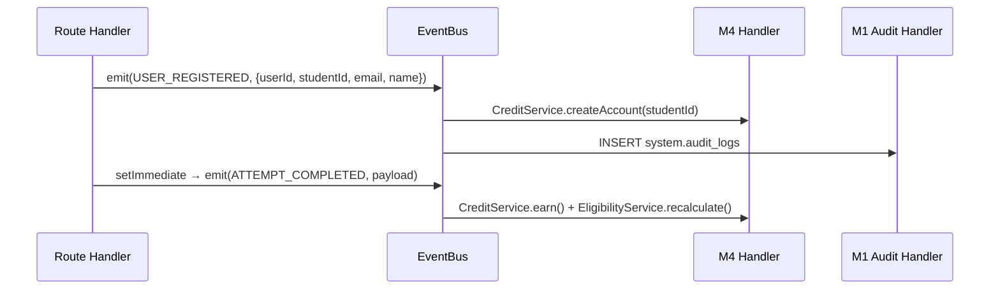

# System Architecture — Communication Readiness Platform

> **Source of truth:** Backend source code + migration files + 4-agent architecture audit (2026-09-28)  
> **Branch audited:** `feature/new-ui-backend-integration`  
> **Supersedes:** `API_DATA_FLOW_ARCHITECTURE.md` (architecture sections), `BACKEND_BLUEPRINT.md`, `PROJECT_CONTEXT.md`  
> **For API contracts:** see `API_SPECIFICATION.md`  
> **For database schema:** see `DATABASE_SCHEMA_DESIGN.md`

---

## Table of Contents

1. [Platform Overview](#1-platform-overview)
2. [Service Topology](#2-service-topology)
3. [Repository Structure](#3-repository-structure)
4. [Request Lifecycle](#4-request-lifecycle)
5. [Module Boundaries](#5-module-boundaries)
6. [Cross-Module Dependencies](#6-cross-module-dependencies)
7. [Event Architecture](#7-event-architecture)
8. [AI Service Integration](#8-ai-service-integration)
9. [Session Context & Redis](#9-session-context--redis)
10. [Frontend ↔ Backend Relationship](#10-frontend--backend-relationship)
11. [Assessment & Session Flow](#11-assessment--session-flow)
12. [Known Limitations](#12-known-limitations)

---

## 1. Platform Overview

An AI-powered mock interview and communication readiness platform for a single college (~2,000–3,000 students). Students take proctored mock interview and listening comprehension assessments; responses are evaluated via a FastAPI AI service (LLM + audio analysis), producing communication and technical scores.

**Five backend roles:** `STUDENT`, `FACULTY_MENTOR`, `PROGRAM_ADMIN`, `TRAINER`, `PLACEMENT_COORDINATOR`

> **Frontend roles `PLATFORM_OWNER` and `SUPER_ADMIN` are mock-only — they do NOT exist in the backend database enum.**

---

## 2. Service Topology

```
┌─────────────────────────────────────────────────────────────────────┐
│               Communication Readiness Platform                       │
│                                                                      │
│  ┌──────────────┐  HTTP/REST      ┌──────────────────────────────┐  │
│  │   Frontend   │ ──────────────▶ │   Express Backend             │  │
│  │ React 19     │  /api → :5000   │   TypeScript + Node.js        │  │
│  │ Vite 8 + TW4 │  /ai  → :8000   │   Port: env.PORT (default 5000)│  │
│  │ Vite proxy   │                 │                               │  │
│  └──────────────┘                 │   ┌───────────────────────┐  │  │
│                                   │   │  In-Process EventBus  │  │  │
│  ┌──────────────┐  HTTP (axios)   │   │  (Node.js EventEmitter)│  │  │
│  │  AI Service  │ ◀────────────── │   └───────────────────────┘  │  │
│  │  FastAPI     │  port 8000      │                               │  │
│  │  Python      │                 │   ┌───────────────────────┐  │  │
│  │  Groq/LLM    │                 │   │  Redis (optional)      │  │  │
│  └──────────────┘                 │   │  ioredis               │  │  │
│                                   │   │  Session turn cache    │  │  │
│  ┌──────────────┐  pg driver      │   └───────────────────────┘  │  │
│  │  PostgreSQL  │ ◀────────────── └──────────────────────────────┘  │
│  │  Supabase    │  pool (max 10)                                     │
│  │  Multi-schema│                                                    │
│  └──────────────┘                                                    │
└─────────────────────────────────────────────────────────────────────┘
```

| Service | Technology | Port | Role |
|---------|-----------|------|------|
| Express Backend | TypeScript, Node.js, Express 4 | `env.PORT` (default 5000) | All business logic, CRUD, auth, event dispatch |
| AI Service | FastAPI (Python) | 8000 | Audio STT (Groq Whisper) + response evaluation (LLM) |
| PostgreSQL | Supabase (cloud) | TCP | Persistent data store — multi-schema design |
| Redis | ioredis | `env.REDIS_URL` | Interview turn context cache (optional, graceful degradation) |
| Frontend | React 19, Vite 8, Tailwind 4 | 5173 (dev) | SPA — calls real backend via Vite proxy |

---

## 3. Repository Structure

```
communication-readiness-platform/
├── backend/
│   ├── src/
│   │   ├── index.ts                ← Server entry: registers routes + M4 event handlers
│   │   ├── app.ts                  ← Express app setup (helmet, cors, json, morgan)
│   │   ├── config/env.ts           ← Zod-validated env vars
│   │   ├── middleware/
│   │   │   ├── authenticate.ts     ← JWT verify + token_version DB check
│   │   │   ├── authorize.ts        ← requireRole() + requireStudentSelfOrStaff()
│   │   │   └── trainerTenure.ts    ← requireActiveTrainerTenure (implemented, not mounted)
│   │   ├── routes/
│   │   │   ├── index.ts            ← All route mounts
│   │   │   ├── auth.routes.ts      ← M1: register/login/logout/me
│   │   │   ├── student.routes.ts   ← M1: student profile + resume
│   │   │   ├── org.routes.ts       ← M1: public dropdowns (institutions/programs/batches/subdivisions)
│   │   │   ├── mentor.routes.ts    ← M1: mentor assignment + my-students
│   │   │   ├── trainer.routes.ts   ← M1: trainer assignment + my-subdivisions
│   │   │   ├── admin.routes.ts     ← M1: user list/role/status/import
│   │   │   ├── programs.routes.ts  ← M1: program + sub-program CRUD
│   │   │   ├── portal.routes.ts    ← M1: STUB — no handlers implemented
│   │   │   └── interview.routes.ts ← M1+M2: audio bank-fallback + turns
│   │   ├── modules/
│   │   │   ├── assessments/        ← M2: assessment CRUD + targeting
│   │   │   ├── attempts/           ← M2: attempt start/get/abandon
│   │   │   ├── sessions/           ← M2: session start/complete/proctor
│   │   │   ├── responses/          ← M2: text response submission + AI eval
│   │   │   ├── reports/            ← M2: assessment reports
│   │   │   ├── question-bank/      ← M2: question bank CRUD
│   │   │   ├── evaluation/         ← M2: ai-client.ts, scoring helpers
│   │   │   ├── credits/            ← M4: routes + CreditService + event-handlers
│   │   │   ├── checklist/          ← M4: checklist CRUD + progress
│   │   │   ├── verifications/      ← M4: mentor verification
│   │   │   └── placement/          ← M4: eligibility routes + EligibilityService
│   │   └── shared/
│   │       ├── db/pool.ts          ← pg.Pool (max 10 connections)
│   │       ├── errors/AppError.ts  ← Typed error class
│   │       ├── helpers/response.ts ← sendSuccess / sendError envelopes
│   │       ├── storage/            ← LocalStorageClient (file uploads)
│   │       └── events/             ← eventBus + typed event definitions
│   ├── src/database/migrations/    ← 001–123: all schema migrations
│   └── tests/                      ← Vitest unit + integration tests
├── ai-service/
│   └── app/
│       ├── main.py                 ← FastAPI entry
│       ├── routers/interview.py    ← /ai/* route handlers
│       ├── services/stt_service.py ← Groq Whisper STT
│       └── services/audio_analyzer.py ← librosa signal analysis
└── frontend/
    └── src/
        ├── services/api.ts         ← Unified API client (real backend + mock fallback)
        ├── context/AppContext.tsx  ← Auth state + app-level actions
        └── hooks/
            ├── useVoiceCapture.ts  ← VAD-powered audio capture (@ricky0123/vad-web)
            └── useQuestionTTS.ts   ← Browser TTS for question playback
```

---

## 4. Request Lifecycle

```
Browser
  └─► Vite dev proxy (/api → :5000, /ai → :8000)
        └─► Express: helmet → cors → json → morgan → router
              └─► /api/* router (routes/index.ts)
                    └─► Per-route: authenticate → requireRole
                          └─► Route handler (inline async controller)
                                ├─► db.query() (pg Pool → PostgreSQL)
                                ├─► CreditService / EligibilityService (cross-module)
                                ├─► axios.post() (FastAPI AI service)
                                └─► sendSuccess(res, data)
                    └─► errorHandler (AppError → JSON error envelope)
```

**Key design:** No service-layer abstraction for most routes — business logic lives inline in route handlers. Exceptions: `CreditService`, `EligibilityService`, `SessionContextService`, `ai-client.ts`.

---

## 5. Module Boundaries

### Module 1 — Identity & Org

**Migrations:** 001–016 (inclusive), 120–123  
**DB schemas owned:** `identity`, `org`, `system`  
**Routes:** `/api/auth/*`, `/api/org/*`, `/api/students/*`, `/api/mentors/*`, `/api/trainers/*`, `/api/admin/*`, `/api/programs/*`, `/api/portals/*` (stub)  
**Also owns:** `interview.routes.ts` (audio bank-fallback + turns — added during audio pipeline integration)

### Module 2 — Assessment Lifecycle

**Migrations:** 031–043  
**DB schemas owned:** `assessment`, `session`, `evaluation`  
**DB shared write:** `performance.assessment_reports` (M2 writes; M3 planned to read)  
**Routes:** `/api/assessments/*`, `/api/attempts/*`, `/api/sessions/*`, `/api/responses/*`, `/api/reports/*`, `/api/question-bank/*`  
**Events emitted:** `ATTEMPT_COMPLETED`  
**External calls:** FastAPI `/ai/evaluate-response` (text path), `/ai/generate-question`

### Module 3 — Performance (NOT IMPLEMENTED)

**Migrations:** 061–069, 080  
**DB schemas owned:** `performance` (profiles/snapshots/skills), `knowledge`  
**Routes:** NONE — no route files exist  
**Status:** Tables created and seeded (21 skills); no API endpoints; `performance.performance_profiles` never written → EligibilityService performance check always fails

### Module 4 — Credits, Checklist, Placement

**Migrations:** 091–099, 105–106  
**DB schemas owned:** `credit`, `placement`  
**Routes:** `/api/credits/*`, `/api/credit-policies/*`, `/api/checklist/*`, `/api/verifications/*`, `/api/placement-eligibility/*`  
**Events handled:** `USER_REGISTERED` → `CreditService.createAccount()`; `ATTEMPT_COMPLETED` → `CreditService.earn()` + `EligibilityService.recalculate()`

---

## 6. Cross-Module Dependencies

```mermaid
graph TD
    M1[M1: Identity/Org] -->|USER_REGISTERED event| M4[M4: Credits/Placement]
    M2[M2: Assessment Engine] -->|CreditService.consume() — direct call| M4
    M2 -->|ATTEMPT_COMPLETED event| M4
    M2 -->|POST /ai/evaluate-response| AI[FastAPI AI Service]
    M2 -->|POST /ai/generate-question| AI
    M4 -->|reads performance.performance_profiles| M3[M3: Performance — NOT IMPL]
    M4 -->|reads org.student_mentor_assignments| M1
    Frontend[Frontend] -->|/api/* via Vite proxy| M1
    Frontend -->|/api/* via Vite proxy| M2
    Frontend -->|/api/* via Vite proxy| M4
```

| Caller | Function | Owner | Status |
|--------|----------|-------|--------|
| M2 `attempts.routes` | `CreditService.consume()` | M4 | `IMPLEMENTED_AND_USED` |
| M2 `sessions.routes` | emits `ATTEMPT_COMPLETED` | M4 handles | `IMPLEMENTED_AND_USED` |
| M1 `auth.routes` | emits `USER_REGISTERED` | M4 handles | `IMPLEMENTED_AND_USED` |
| M4 `EligibilityService` | reads `performance.performance_profiles` | M3 | `BLOCKED` — M3 not implemented; perfScore always 0 |
| M4 `EligibilityService` | reads `org.student_mentor_assignments` | M1 | `IMPLEMENTED_AND_USED` |
| M4 `verifications.routes` | reads `org.student_mentor_assignments` | M1 | `IMPLEMENTED_AND_USED` |

---

## 7. Event Architecture

**Transport:** In-process Node.js `EventEmitter` (not durable — events lost on crash). `setMaxListeners(20)`.



| Event | Emitted By | Handlers | Status |
|-------|-----------|---------|--------|
| `USER_REGISTERED` | `POST /api/auth/register`, admin CSV import (new students) | M4: `createAccount()`; M1: audit log | `IMPLEMENTED_AND_USED` |
| `ATTEMPT_COMPLETED` | `POST /api/sessions/:id/complete` (via `setImmediate`) | M4: `earn()` + `recalculate()` | `IMPLEMENTED_AND_USED` |
| `CHECKLIST_ITEM_TOGGLED` | `POST /api/checklist/:itemId/toggle` | None registered | Emitted, no consumer |
| `MENTOR_VERIFIED` | `POST /api/verifications/:progressId/verify` | None registered (eligibility called inline) | Emitted, no consumer |

**Earn amount note:** `ATTEMPT_COMPLETED` handler earns credits using `credit_policies.consume_amount` as the earn amount (no separate `earn_amount` column). Both default to 10 in the seed.

---

## 8. AI Service Integration

The backend never calls FastAPI directly from route handlers — all calls go through `ai-client.ts` (text path) or inline axios in `interview.routes.ts` (audio path).

### Path A — Text Evaluation (responses.routes.ts)

```
POST /api/responses/submit
  → ai-client.evaluateResponse()
  → POST http://AI_SERVICE_URL/ai/evaluate-response
     Request: { transcript, question_text, duration_sec, difficulty, student_name }
     Response: { technical_score (0-10), communication_score (0-10), fluency_score,
                 clarity_score, pace_wpm, filler_count, feedback, strengths, weaknesses }
  → Node.js normalises: technical_score * 10, communication_score * 10
  → INSERT evaluation.response_evaluations
```

### Path B — Audio Evaluation (interview.routes.ts)

```
POST /api/sessions/:id/turns
  → multer.single('audio') (WAV, max 10MB)
  → sessionContextService.getTurns() (last 10 turns from Redis)
  → axios.post(AI_SERVICE_URL + '/ai/evaluate-response', FormData, { timeout: 60s })
     FormData: { audio: Buffer, metadata: JSON string }
     FastAPI pipeline: STT (Groq Whisper) + signal analysis (librosa) → LLM evaluation
     Response: { transcript, technical_score (0-10), filler_count, fluency_score,
                 clarity_score, feedback, strengths, weaknesses, next_recommended_difficulty,
                 pace_wpm, stt_raw }
  → normaliseScores(): 
       technicalScore = round(technical_score * 10)
       communicationScore = round((100 - filler_count * 5) * 0.4 + fluency_score * 0.3 + clarity_score * 0.3)
       overallScore = round(technicalScore * 0.7 + communicationScore * 0.3)
  → sessionContextService.appendTurn() → Redis
  → process.nextTick → sessionContextService.flushToDb() → session.interview_transcripts
  ⚠️  Does NOT write evaluation.response_evaluations → cannot use POST /sessions/:id/complete
```

> **Critical gap:** Audio-only sessions (Path B) and text sessions (Path A) are parallel, incompatible flows. A session that uses only audio turns cannot call `POST /sessions/:id/complete` — it queries `evaluation.response_evaluations` which gets 0 rows from audio turns, returning 422 `NO_RESPONSES`.

**Graceful degradation:** Any AI service timeout or error → scores = 0, `aiReachable: false` in response. Session can continue.

**AI LLM providers (ai-service config):** groq (default, llama-3.3-70b-versatile), openai, anthropic, together, perplexity, ollama, lmstudio, vllm, mock.

---

## 9. Session Context & Redis

`SessionContextService` (singleton) manages in-flight interview context.

- **Append:** `RPUSH session:{sessionId}:context {turn JSON}` + `EXPIRE 7200`
- **Get last N:** `LRANGE session:{sessionId}:context -(N) -1` — injected into FastAPI evaluation as `previous_turns`
- **Flush to DB:** Batch `INSERT session.interview_transcripts ON CONFLICT DO NOTHING` — idempotent
- **Flush trigger:** `process.nextTick()` after every audio turn response (non-blocking)
- **Graceful degradation:** Redis unavailable → `getTurns()` returns `[]`; `flushToDb()` fails silently; audio scores still returned

---

## 10. Frontend ↔ Backend Relationship

**Current state (as of `feature/new-ui-backend-integration`):** Frontend calls real backend with mock fallback.

```mermaid
graph LR
    FE[Frontend api.ts] -->|request() — relative /auth/*| BE[Express :5000]
    FE -->|apiFetch() — /api/* paths| BE
    BE -->|5xx or network error| Mock[Mock data fallback]
    FE -->|DEMO_EMAILS list| Mock
    BE -->|/api/* responses| FE
```

**Dual-method architecture in `api.ts`:**
- `request(method, path, body)` — relative paths (`/auth/login`), JSON only
- `apiFetch(path, options)` — absolute `/api/...` paths, supports FormData

**Vite proxy (`frontend/vite.config.ts`):**
- `/api` → `http://localhost:5000`
- `/ai` → `http://localhost:8000`

**Auth hydration:** On page load, `AppContext` calls `GET /api/auth/me` to restore user state from stored JWT.

**Known frontend → backend mismatches:**
| Frontend call | Backend expects | Issue |
|---------------|----------------|-------|
| `tasks.verifyTask` sends `{ outcome: 'VERIFIED' }` | `{ status: 'VERIFIED' }` | **Bug** — will always return 422 |
| `admin.createFacultyMentor` | No backend route | Mock-only — missing `POST /admin/users` creation |
| `admin.createStudent` uses mock `fetchFirstBatchId()` | Needs real `batchId` UUID | Fragile without live batch |

---

## 11. Assessment & Session Flow

```mermaid
sequenceDiagram
    participant S as Student
    participant BE as Backend
    participant CS as CreditService
    participant AI as FastAPI
    participant DB as PostgreSQL

    S->>BE: POST /api/attempts/start {assessmentId}
    BE->>CS: consume(studentId, 10, 'ASSESSMENT_START', assessmentId)
    CS->>DB: SELECT FOR UPDATE credit_accounts; UPDATE; INSERT credit_transactions
    BE->>DB: INSERT assessment_attempts (status=IN_PROGRESS)
    BE-->>S: { attemptId, creditBalance }

    S->>BE: POST /api/sessions/start {attemptId}
    BE->>DB: INSERT assessment_sessions
    BE->>DB: SELECT question_bank_items (or POST /ai/generate-question)
    BE->>DB: INSERT questions
    BE-->>S: { sessionId, firstQuestion }

    loop Each turn (text path)
        S->>BE: POST /api/responses/submit {transcript, questionId}
        BE->>AI: POST /ai/evaluate-response (text)
        AI-->>BE: { scores, feedback }
        BE->>DB: INSERT responses + ai_runs + response_evaluations
        BE-->>S: { scores, nextQuestion }
    end

    S->>BE: POST /api/sessions/:id/complete
    BE->>DB: SELECT response_evaluations (aggregate scores)
    BE->>DB: INSERT performance.assessment_reports
    BE->>DB: UPDATE assessment_sessions (COMPLETED), UPDATE assessment_attempts (COMPLETED)
    BE-->>S: { reportId, overallScore }
    BE->>BE: setImmediate → emit(ATTEMPT_COMPLETED)
```

---

## 12. Known Limitations

| ID | Description | Impact | Path to fix |
|----|------------|--------|-------------|
| L1 | **M3 not implemented** — `performance.performance_profiles` never written | EligibilityService perfScore = 0; all students fail performance criterion for placement | Implement M3 ATTEMPT_COMPLETED listener |
| L2 | **Audio and text sessions are incompatible** — audio turns (Path B) cannot feed into `POST /sessions/:id/complete` | Sessions using the audio pipeline cannot generate reports via M2 session-complete flow | Merge audio turn scoring into evaluation schema, or create separate complete endpoint for audio sessions |
| L3 | **Portal routes are stubs** — all `/api/portals/*` endpoints return 404 | Portals not functional | Implement portal.routes.ts handlers |
| L4 | **`trainerTenure` middleware not mounted** — `requireActiveTrainerTenure` exists but applied to no route | Trainers not scope-checked on subdivision routes | Mount middleware on subdivision-scoped trainer routes |
| L5 | **`verify` field mismatch** — frontend sends `{ outcome }`, backend expects `{ status }` | `POST /api/verifications/:id/verify` always returns 422 from frontend | Fix `tasks.verifyTask` in `api.ts` |
| L6 | **No refresh tokens** — JWT expires after `JWT_EXPIRES_IN` (default 7d); no renewal mechanism | Users must re-login after token expiry | Add refresh token endpoint |
| L7 | **`session.question_bank` vs `session.question_bank_items`** — bank-fallback may query wrong table | Potential 500 on bank-fallback if `session.question_bank` doesn't exist | Verify correct table name in interview.routes.ts bank-fallback |
| L8 | **Migration 116 FK defect** — adds FK `response_id → evaluation.responses` on column that doesn't exist in migration 016 | FK may fail silently or error on apply | Add `response_id` column to `session.interview_transcripts` |
| L9 | **M3 eligibility block** — `EligibilityService` reads `performance.performance_profiles` (M3 table) which is always empty | All placement eligibility checks fail performance criterion until M3 is built | Either implement M3 or add bypass/threshold logic |
