# UML Class Diagram — AI-Powered Communication Readiness Platform

Comprehensive UML Class Diagram extracted directly from the system design specification.

## Architectural Layers Represented
1. **Identity & Access Control (RBAC + Scoping)**
2. **Academic & Organization Hierarchy**
3. **Assessment Orchestration & Dynamic Execution**
4. **AI Evaluation, Speech & Communication Analysis**
5. **Performance Profiles, Snapshots & Reporting**
6. **Credit System & Auditing**
7. **Domain Services & Provider Abstractions**

---

```mermaid
classDiagram
    direction TB

    %% ---------------------------------------------------------
    %% ENUMERATIONS
    %% ---------------------------------------------------------
    class UserStatus {
        <<enumeration>>
        ACTIVE
        INACTIVE
        PENDING_VERIFICATION
        SUSPENDED
    }

    class ScopeType {
        <<enumeration>>
        GLOBAL
        PROGRAM
        DOMAIN
        BATCH
        DEPARTMENT
    }

    class StudentStatus {
        <<enumeration>>
        ENROLLED
        ACTIVE
        GRADUATED
        INACTIVE
    }

    class AssessmentType {
        <<enumeration>>
        TECHNICAL_INTERVIEW
        LISTENING_ASSESSMENT
        BEHAVIORAL_INTERVIEW
        COMPREHENSIVE
    }

    class InterviewType {
        <<enumeration>>
        ADAPTIVE_TECHNICAL
        HR_COMMUNICATION
        SYSTEM_DESIGN
    }

    class ComponentType {
        <<enumeration>>
        TECHNICAL_KNOWLEDGE
        COMMUNICATION_ANALYSIS
        LISTENING_COMPREHENSION
    }

    class AttemptStatus {
        <<enumeration>>
        NOT_STARTED
        IN_PROGRESS
        COMPLETED
        ABANDONED
        EVALUATED
    }

    class SessionStatus {
        <<enumeration>>
        INITIALIZED
        ACTIVE
        PAUSED
        COMPLETED
        TERMINATED
    }

    class Difficulty {
        <<enumeration>>
        EASY
        MEDIUM
        ADVANCED
    }

    class QuestionSource {
        <<enumeration>>
        QUESTION_BANK
        AI_GENERATED
        DYNAMIC_FOLLOWUP
    }

    class ResponseMode {
        <<enumeration>>
        VOICE
        TEXT
        MIXED
    }

    class Trend {
        <<enumeration>>
        IMPROVING
        STABLE
        DECLINING
    }

    class CreditTransactionType {
        <<enumeration>>
        CONSUMPTION
        EARNING
        ADMIN_ADJUSTMENT
        REFUND
    }

    %% ---------------------------------------------------------
    %% IDENTITY & RBAC
    %% ---------------------------------------------------------
    class User {
        +UUID id
        +String name
        +String email
        +UserStatus status
        +DateTime createdAt
    }

    class Role {
        +UUID id
        +String name
    }

    class Permission {
        +UUID id
        +String resource
        +String action
    }

    class RoleAssignment {
        +UUID id
        +UUID userId
        +UUID roleId
        +UUID accessScopeId
        +DateTime assignedAt
        +Boolean isActive
    }

    class AccessScope {
        +UUID id
        +ScopeType scopeType
        +UUID scopeId
    }

    class Department {
        +UUID id
        +String name
        +Boolean isActive
    }

    %% ---------------------------------------------------------
    %% ACADEMIC HIERARCHY
    %% ---------------------------------------------------------
    class Program {
        +UUID id
        +String name
        +String description
        +Boolean isActive
    }

    class Domain {
        +UUID id
        +UUID programId
        +String name
        +Boolean isActive
    }

    class Batch {
        +UUID id
        +UUID programId
        +String name
        +Int startYear
        +Boolean isActive
    }

    class Student {
        +UUID id
        +UUID userId
        +UUID batchId
        +UUID programId
        +UUID domainId
        +String subdivision
        +StudentStatus status
    }

    class StudentMentorAssignment {
        +UUID id
        +UUID studentId
        +UUID mentorId
        +DateTime assignedAt
        +DateTime endedAt
        +Boolean isActive
    }

    class Resume {
        +UUID id
        +UUID studentId
        +String fileReference
        +Text parsedText
        +DateTime uploadedAt
        +Int version
    }

    %% ---------------------------------------------------------
    %% ASSESSMENT ORCHESTRATION
    %% ---------------------------------------------------------
    class Assessment {
        +UUID id
        +String name
        +AssessmentType type
        +String description
        +Boolean isActive
    }

    class AssessmentConfiguration {
        +UUID id
        +UUID assessmentId
        +Int maxAttempts
        +Int creditCost
        +InterviewType interviewType
        +DateTime effectiveFrom
        +DateTime effectiveTo
    }

    class AssessmentComponent {
        +UUID id
        +UUID configurationId
        +ComponentType componentType
        +Decimal weight
        +Boolean isEnabled
    }

    class AssessmentAttempt {
        +UUID id
        +UUID studentId
        +UUID assessmentId
        +Int attemptNumber
        +AttemptStatus status
        +DateTime startedAt
        +DateTime completedAt
    }

    class InterviewSession {
        +UUID id
        +UUID attemptId
        +InterviewType interviewType
        +Difficulty currentDifficulty
        +SessionStatus status
    }

    class ListeningSession {
        +UUID id
        +UUID attemptId
        +SessionStatus status
    }

    %% ---------------------------------------------------------
    %% QUESTIONS, RESPONSES & EVALUATIONS
    %% ---------------------------------------------------------
    class Question {
        +UUID id
        +UUID sessionId
        +Text text
        +Difficulty difficulty
        +QuestionSource source
    }

    class QuestionBankItem {
        +UUID id
        +Text questionText
        +Difficulty difficulty
        +String skill
        +Boolean isActive
    }

    class Response {
        +UUID id
        +UUID questionId
        +ResponseMode mode
        +Text transcript
        +DateTime submittedAt
    }

    class EvaluationResult {
        +UUID id
        +UUID responseId
        +Decimal score
        +Decimal confidence
        +Text strengths
        +Text weaknesses
        +Text feedback
        +String evaluationVersion
    }

    class CommunicationAnalysis {
        +UUID id
        +UUID responseId
        +Decimal fluencyScore
        +Decimal clarityScore
        +Decimal paceScore
        +Decimal pitchScore
        +DateTime analyzedAt
    }

    %% ---------------------------------------------------------
    %% PERFORMANCE & REPORTING
    %% ---------------------------------------------------------
    class AssessmentReport {
        +UUID id
        +UUID attemptId
        +Decimal totalScore
        +DateTime generatedAt
        +String scoringVersion
        +Text feedback
        +Text strengths
        +Text weaknesses
        +Text recommendations
        +Text learningPath
    }

    class PerformanceProfile {
        +UUID id
        +UUID studentId
        +Decimal technicalScore
        +Decimal communicationScore
        +Decimal listeningScore
        +Decimal overallScore
        +Decimal previousOverallScore
        +Trend trend
    }

    class PerformanceSnapshot {
        +UUID id
        +UUID studentId
        +Decimal technicalScore
        +Decimal communicationScore
        +Decimal listeningScore
        +Decimal overallScore
        +DateTime capturedAt
    }

    class SkillPerformance {
        +UUID id
        +UUID profileId
        +UUID reportId
        +String skillName
        +Decimal score
        +Trend trend
    }

    %% ---------------------------------------------------------
    %% CREDITS
    %% ---------------------------------------------------------
    class CreditAccount {
        +UUID id
        +UUID studentId
        +Int balance
        +Int maximumBalance
    }

    class CreditTransaction {
        +UUID id
        +UUID accountId
        +Int amount
        +CreditTransactionType type
        +String reason
        +UUID referenceId
        +DateTime createdAt
    }

    class CreditPolicy {
        +UUID id
        +ScopeType scopeType
        +Int maximumBalance
        +String earningRule
        +String consumptionRule
        +Boolean isActive
    }

    %% ---------------------------------------------------------
    %% DOMAIN SERVICES & PROVIDER ABSTRACTIONS
    %% ---------------------------------------------------------
    class AuthorizationService {
        +authenticate(credentials) Token
        +authorize(userId, permission, scope) Boolean
        +resolveScope(user, resource) AccessScope
    }

    class AssessmentService {
        +createAssessment(data) Assessment
        +configureAssessment(assessmentId, config) AssessmentConfiguration
        +startAttempt(studentId, assessmentId) AssessmentAttempt
        +completeAttempt(attemptId) AssessmentReport
    }

    class InterviewService {
        +initiateSession(attemptId, type) InterviewSession
        +getNextQuestion(sessionId) Question
        +submitAnswer(sessionId, questionId, response) EvaluationResult
        +adjustDifficulty(sessionId, score) Difficulty
    }

    class ListeningService {
        +initiateSession(attemptId) ListeningSession
        +getListeningStory(sessionId) Story
        +submitResponses(sessionId, answers) EvaluationResult
    }

    class EvaluationService {
        +evaluateTechnicalAnswer(question, response, context) EvaluationResult
        +analyzeCommunication(audioStream, transcript) CommunicationAnalysis
        +computeAggregateScore(evalResult, commAnalysis) Decimal
    }

    class PerformanceService {
        +getStudentProfile(studentId) PerformanceProfile
        +updateProfile(studentId, report) PerformanceProfile
        +takeSnapshot(studentId) PerformanceSnapshot
        +getBatchPerformance(batchId) BatchPerformanceReport
    }

    class ReportService {
        +generateReport(attemptId) AssessmentReport
        +getReportById(reportId) AssessmentReport
        +exportReportPdf(reportId) Binary
    }

    class CreditService {
        +getBalance(studentId) Int
        +consumeCredits(studentId, amount, reason) CreditTransaction
        +awardCredits(studentId, amount, reason) CreditTransaction
        +checkPolicy(studentId) Boolean
    }

    class QuestionGenerationService {
        +generateQuestion(skill, difficulty, resumeContext) Question
        +retrieveFromBank(skill, difficulty) Question
    }

    class LearningRecommendationService {
        +generateRecommendations(studentId, skillGaps) LearningPlan
        +publishPlan(studentId, plan) Void
    }

    class LLMProvider {
        <<interface>>
        +generateText(prompt, systemPrompt, options) String
        +evaluateStructured(rubric, inputData) JSON
    }

    class KnowledgeProvider {
        <<interface>>
        +retrieveSemanticContext(query, topK) List~Document~
        +fallbackWebSearch(query) List~Document~
    }

    class WebSearchProvider {
        <<interface>>
        +search(query) SearchResults
    }

    class SpeechProvider {
        <<interface>>
        +transcribe(audioData) Transcript
    }

    class CommunicationAnalyzer {
        <<interface>>
        +extractMetrics(audioData, transcript) AudioMetrics
    }

    %% ---------------------------------------------------------
    %% RELATIONSHIPS
    %% ---------------------------------------------------------
    User "1" *-- "0..*" RoleAssignment : assigned
    RoleAssignment "0..*" --> "1" Role : references
    Role "1" --> "0..*" Permission : defines
    RoleAssignment "0..*" --> "1" AccessScope : scoped_to
    Department "1" --> "0..*" User : belongs_to

    Program "1" --> "0..*" Domain : contains
    Program "1" --> "0..*" Batch : contains
    Student "0..*" --> "1" Program : enrolled_in
    Student "0..*" --> "1" Domain : specializes_in
    Student "0..*" --> "1" Batch : belongs_to
    Student "1" *-- "1..*" Resume : owns
    Student "1" --> "0..*" StudentMentorAssignment : guided_by
    User "1" <-- "0..*" StudentMentorAssignment : mentor

    Assessment "1" *-- "1" AssessmentConfiguration : configured_by
    AssessmentConfiguration "1" *-- "1..*" AssessmentComponent : includes
    Assessment "1" --> "0..*" AssessmentAttempt : instantiated_as
    Student "1" --> "0..*" AssessmentAttempt : undertakes

    AssessmentAttempt "1" *-- "0..1" InterviewSession : hosts
    AssessmentAttempt "1" *-- "0..1" ListeningSession : hosts
    AssessmentAttempt "1" *-- "1" AssessmentReport : generates

    InterviewSession "1" *-- "1..*" Question : contains
    ListeningSession "1" *-- "1..*" Question : contains
    Question "0..1" --> "0..1" QuestionBankItem : sourced_from
    Question "1" *-- "1" Response : answered_by

    Response "1" *-- "1" EvaluationResult : evaluated_as
    Response "1" --> "0..1" CommunicationAnalysis : measured_by

    Student "1" *-- "1" PerformanceProfile : current_state
    Student "1" *-- "0..*" PerformanceSnapshot : historical_record
    AssessmentReport "1" --> "1..*" SkillPerformance : breaks_down
    PerformanceProfile "1" *-- "1..*" SkillPerformance : aggregated_skills

    Student "1" *-- "1" CreditAccount : owns
    CreditAccount "1" *-- "0..*" CreditTransaction : logs
    CreditPolicy "0..*" --> "1" AccessScope : governs

    AssessmentService ..> Assessment : manages
    AssessmentService ..> AssessmentConfiguration : applies
    AssessmentService ..> AssessmentAttempt : orchestrates
    InterviewService ..> InterviewSession : executes
    InterviewService ..> QuestionGenerationService : requests
    ListeningService ..> ListeningSession : executes
    EvaluationService ..> EvaluationResult : creates
    EvaluationService ..> CommunicationAnalysis : invokes
    EvaluationService ..> LLMProvider : uses
    PerformanceService ..> PerformanceProfile : aggregates
    PerformanceService ..> PerformanceSnapshot : records
    ReportService ..> AssessmentReport : compiles
    CreditService ..> CreditAccount : mutates
    CreditService ..> CreditTransaction : records
    AuthorizationService ..> User : authenticates
    QuestionGenerationService ..> KnowledgeProvider : queries
    QuestionGenerationService ..> LLMProvider : prompts
    KnowledgeProvider ..> WebSearchProvider : fallbacks_to
    CommunicationAnalyzer ..> SpeechProvider : delegates_audio
```

