```mermaid
erDiagram

    %% =========================================================
    %% IDENTITY & RBAC
    %% =========================================================
    USER {
        uuid id PK
        string name
        string email
        enum status "ACTIVE | INACTIVE | PENDING | SUSPENDED"
        timestamp created_at
    }

    ROLE {
        uuid id PK
        string name
    }

    PERMISSION {
        uuid id PK
        string resource
        string action
    }

    ROLE_PERMISSION {
        uuid role_id FK
        uuid permission_id FK
    }

    ROLE_ASSIGNMENT {
        uuid id PK
        uuid user_id FK
        uuid role_id FK
        uuid access_scope_id FK
        timestamp assigned_at
        boolean is_active
    }

    ACCESS_SCOPE {
        uuid id PK
        enum scope_type "GLOBAL | PROGRAM | DOMAIN | BATCH | DEPARTMENT"
        uuid scope_id
    }

    %% =========================================================
    %% ACADEMIC & ORGANISATION HIERARCHY
    %% =========================================================
    DEPARTMENT {
        uuid id PK
        string name
        boolean is_active
    }

    PROGRAM {
        uuid id PK
        string name
        string description
        boolean is_active
    }

    DOMAIN {
        uuid id PK
        uuid program_id FK
        string name
        boolean is_active
    }

    BATCH {
        uuid id PK
        uuid program_id FK
        string name
        int start_year
        boolean is_active
    }

    STUDENT {
        uuid id PK
        uuid user_id FK
        uuid batch_id FK
        uuid program_id FK
        uuid domain_id FK
        string subdivision
        enum status "ENROLLED | ACTIVE | GRADUATED | INACTIVE"
    }

    STUDENT_MENTOR_ASSIGNMENT {
        uuid id PK
        uuid student_id FK
        uuid mentor_user_id FK
        timestamp assigned_at
        timestamp ended_at
        boolean is_active
    }

    RESUME {
        uuid id PK
        uuid student_id FK
        string file_reference
        text parsed_text
        timestamp uploaded_at
        int version
    }

    %% =========================================================
    %% ASSESSMENT ORCHESTRATION
    %% =========================================================
    ASSESSMENT {
        uuid id PK
        string name
        enum type "TECHNICAL_INTERVIEW | LISTENING | BEHAVIORAL | COMPREHENSIVE"
        string description
        boolean is_active
    }

    ASSESSMENT_CONFIGURATION {
        uuid id PK
        uuid assessment_id FK
        int max_attempts
        int credit_cost
        enum interview_type "ADAPTIVE_TECHNICAL | HR_COMMUNICATION | SYSTEM_DESIGN"
        timestamp effective_from
        timestamp effective_to
    }

    ASSESSMENT_COMPONENT {
        uuid id PK
        uuid configuration_id FK
        enum component_type "TECHNICAL | COMMUNICATION | LISTENING"
        decimal weight
        boolean is_enabled
    }

    ASSESSMENT_ATTEMPT {
        uuid id PK
        uuid student_id FK
        uuid assessment_id FK
        int attempt_number
        enum status "NOT_STARTED | IN_PROGRESS | COMPLETED | ABANDONED | EVALUATED"
        timestamp started_at
        timestamp completed_at
    }

    INTERVIEW_SESSION {
        uuid id PK
        uuid attempt_id FK
        enum interview_type "ADAPTIVE_TECHNICAL | HR_COMMUNICATION | SYSTEM_DESIGN"
        enum current_difficulty "EASY | MEDIUM | ADVANCED"
        enum status "INITIALIZED | ACTIVE | PAUSED | COMPLETED | TERMINATED"
    }

    LISTENING_SESSION {
        uuid id PK
        uuid attempt_id FK
        enum status "INITIALIZED | ACTIVE | COMPLETED | TERMINATED"
    }

    %% =========================================================
    %% QUESTIONS, RESPONSES & EVALUATION
    %% =========================================================
    QUESTION_BANK_ITEM {
        uuid id PK
        text question_text
        enum difficulty "EASY | MEDIUM | ADVANCED"
        string skill
        boolean is_active
    }

    QUESTION {
        uuid id PK
        uuid session_id FK
        uuid bank_item_id FK "nullable — null if AI-generated"
        text text
        enum difficulty "EASY | MEDIUM | ADVANCED"
        enum source "QUESTION_BANK | AI_GENERATED | DYNAMIC_FOLLOWUP"
    }

    RESPONSE {
        uuid id PK
        uuid question_id FK
        enum mode "VOICE | TEXT | MIXED"
        text transcript
        timestamp submitted_at
    }

    EVALUATION_RESULT {
        uuid id PK
        uuid response_id FK
        decimal score
        decimal confidence
        text strengths
        text weaknesses
        text feedback
        string evaluation_version
    }

    COMMUNICATION_ANALYSIS {
        uuid id PK
        uuid response_id FK
        decimal fluency_score
        decimal clarity_score
        decimal pace_score
        decimal pitch_score
        timestamp analyzed_at
    }

    %% =========================================================
    %% REPORTS & PERFORMANCE
    %% =========================================================
    ASSESSMENT_REPORT {
        uuid id PK
        uuid attempt_id FK
        decimal total_score
        timestamp generated_at
        string scoring_version
        text feedback
        text strengths
        text weaknesses
        text recommendations
        text learning_path
    }

    PERFORMANCE_PROFILE {
        uuid id PK
        uuid student_id FK
        decimal technical_score
        decimal communication_score
        decimal listening_score
        decimal overall_score
        decimal previous_overall_score
        enum trend "IMPROVING | STABLE | DECLINING"
    }

    PERFORMANCE_SNAPSHOT {
        uuid id PK
        uuid student_id FK
        decimal technical_score
        decimal communication_score
        decimal listening_score
        decimal overall_score
        timestamp captured_at
    }

    SKILL_PERFORMANCE {
        uuid id PK
        uuid profile_id FK "nullable"
        uuid report_id FK "nullable"
        string skill_name
        decimal score
        enum trend "IMPROVING | STABLE | DECLINING"
    }

    %% =========================================================
    %% CREDITS
    %% =========================================================
    CREDIT_POLICY {
        uuid id PK
        enum scope_type "GLOBAL | PROGRAM | DOMAIN | BATCH | DEPARTMENT"
        int maximum_balance
        string earning_rule
        string consumption_rule
        boolean is_active
    }

    CREDIT_ACCOUNT {
        uuid id PK
        uuid student_id FK
        int balance
        int maximum_balance
    }

    CREDIT_TRANSACTION {
        uuid id PK
        uuid account_id FK
        int amount
        enum type "CONSUMPTION | EARNING | ADMIN_ADJUSTMENT | REFUND"
        string reason
        uuid reference_id
        timestamp created_at
    }

    %% =========================================================
    %% RELATIONSHIPS
    %% =========================================================

    %% RBAC
    USER ||--o{ ROLE_ASSIGNMENT : "holds"
    ROLE_ASSIGNMENT }o--|| ROLE : "of"
    ROLE ||--o{ ROLE_PERMISSION : "grants"
    ROLE_PERMISSION }o--|| PERMISSION : "access_to"
    ROLE_ASSIGNMENT }o--|| ACCESS_SCOPE : "within"

    %% Org Hierarchy
    DEPARTMENT ||--o{ USER : "associated_with"
    PROGRAM ||--o{ DOMAIN : "contains"
    PROGRAM ||--o{ BATCH : "contains"
    STUDENT }o--|| USER : "is_a"
    STUDENT }o--|| PROGRAM : "enrolled_in"
    STUDENT }o--|| DOMAIN : "specializes_in"
    STUDENT }o--|| BATCH : "belongs_to"
    STUDENT ||--o{ STUDENT_MENTOR_ASSIGNMENT : "guided_by"
    STUDENT_MENTOR_ASSIGNMENT }o--|| USER : "mentor"
    STUDENT ||--o{ RESUME : "uploaded"

    %% Assessments
    ASSESSMENT ||--|| ASSESSMENT_CONFIGURATION : "configured_by"
    ASSESSMENT_CONFIGURATION ||--o{ ASSESSMENT_COMPONENT : "includes"
    ASSESSMENT ||--o{ ASSESSMENT_ATTEMPT : "instantiates"
    STUDENT ||--o{ ASSESSMENT_ATTEMPT : "undertakes"
    ASSESSMENT_ATTEMPT ||--o| INTERVIEW_SESSION : "contains"
    ASSESSMENT_ATTEMPT ||--o| LISTENING_SESSION : "contains"
    ASSESSMENT_ATTEMPT ||--|| ASSESSMENT_REPORT : "generates"

    %% Questions & Responses
    INTERVIEW_SESSION ||--o{ QUESTION : "poses"
    LISTENING_SESSION ||--o{ QUESTION : "poses"
    QUESTION }o--o| QUESTION_BANK_ITEM : "sourced_from"
    QUESTION ||--|| RESPONSE : "answered_by"
    RESPONSE ||--|| EVALUATION_RESULT : "evaluated_as"
    RESPONSE ||--o| COMMUNICATION_ANALYSIS : "analyzed_by"

    %% Performance
    STUDENT ||--|| PERFORMANCE_PROFILE : "current_state"
    STUDENT ||--o{ PERFORMANCE_SNAPSHOT : "historical_record"
    PERFORMANCE_PROFILE ||--o{ SKILL_PERFORMANCE : "aggregates"
    ASSESSMENT_REPORT ||--o{ SKILL_PERFORMANCE : "details"

    %% Credits
    STUDENT ||--|| CREDIT_ACCOUNT : "owns"
    CREDIT_ACCOUNT ||--o{ CREDIT_TRANSACTION : "logs"
    CREDIT_POLICY ||--o{ CREDIT_ACCOUNT : "governs"
```

# Data Model — AI-Powered Communication Readiness Platform

Entity-Relationship overview of the PostgreSQL schema, organized by logical domain.  
All entities use UUID primary keys. Soft-deletion is preferred over hard-deletion to preserve audit integrity.

---

---

## Schema Partitioning

All tables share a single PostgreSQL instance but are organized into logical schemas for isolation:

| Schema | Tables |
|--------|--------|
| `identity` | `user`, `role`, `permission`, `role_permission`, `role_assignment`, `access_scope` |
| `org` | `department`, `program`, `domain`, `batch`, `student`, `student_mentor_assignment`, `resume` |
| `assessment` | `assessment`, `assessment_configuration`, `assessment_component`, `assessment_attempt` |
| `session` | `interview_session`, `listening_session`, `question_bank_item`, `question` |
| `evaluation` | `response`, `evaluation_result`, `communication_analysis` |
| `performance` | `assessment_report`, `performance_profile`, `performance_snapshot`, `skill_performance` |
| `credit` | `credit_policy`, `credit_account`, `credit_transaction` |
| `knowledge` | Embedding tables (pgvector), knowledge document metadata |

## Key Design Decisions

- **UUID primary keys** across all tables — safe for distributed insertion patterns
- **No hard deletes** — `is_active`, `status` enums, and `ended_at` timestamps are used for soft deletion
- **`AssessmentReport` is immutable** — never updated after generation; represents a historical snapshot
- **`PerformanceProfile` is mutable** — the single always-current aggregated state per student
- **`PerformanceSnapshot` is append-only** — each attempt completion takes a snapshot for trend analysis
- **`CreditTransaction` is append-only** — complete financial ledger; balance is computed from transactions
- **`pgvector` embeddings** stored in the `knowledge` schema alongside document metadata — avoids a separate vector database dependency
