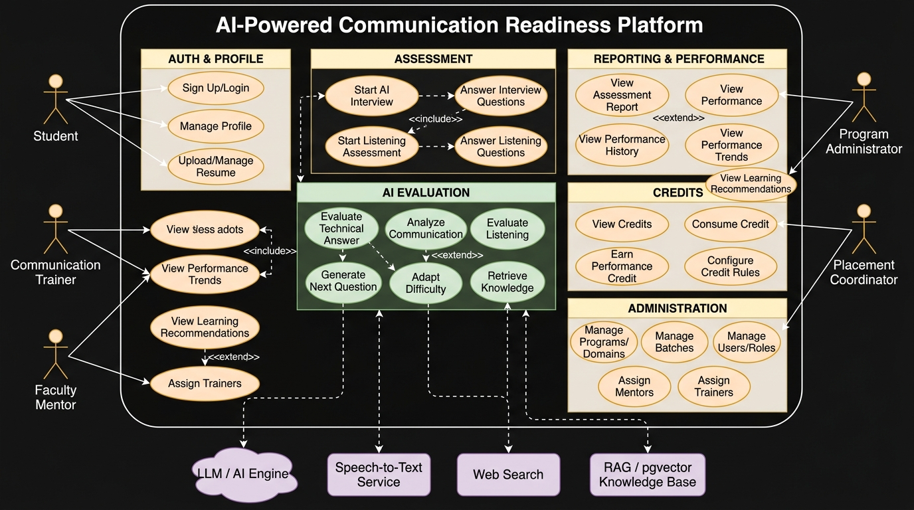
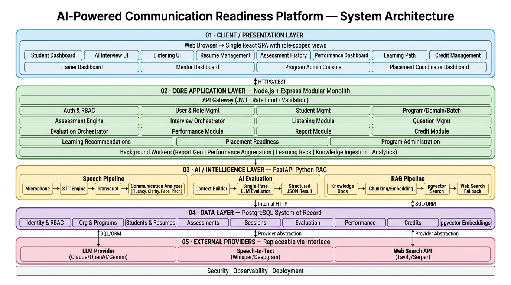
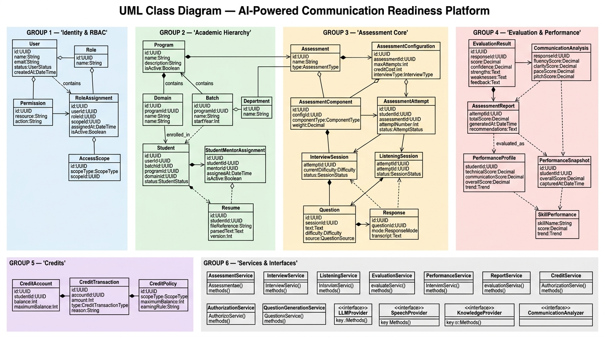
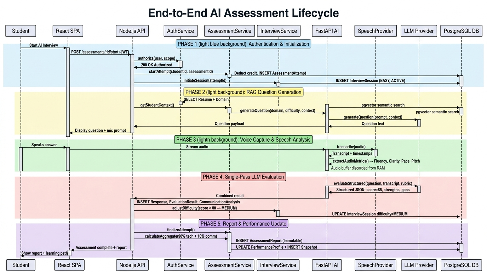
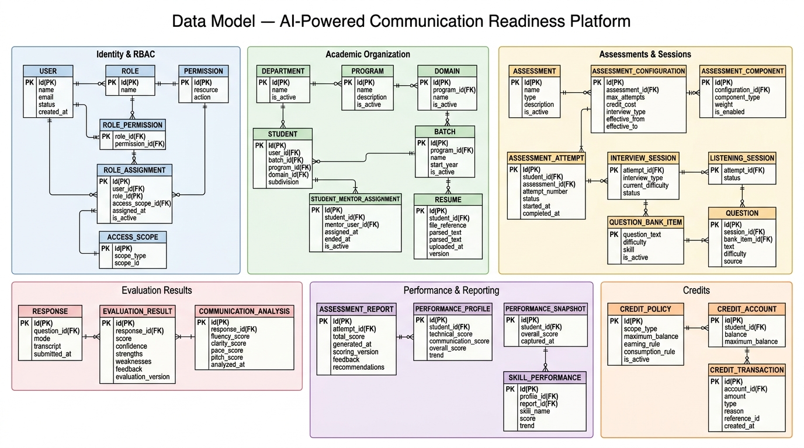

# Architecture Diagram Gallery
### AI-Powered Communication Readiness Platform

All diagrams are also available as Mermaid source in the corresponding .md files.

---

## 1. UML Use Case Diagram
> 5 Actors · 40+ Use Cases · 4 External Systems · <<include>> / <<extend>> relationships

---

## 2. System Architecture (5-Layer)
> Client · Core App · AI Intelligence · Data · External Providers · 15 Architecture Principles

---

## 3. UML Class Diagram
> 45 Classes · 34 Interfaces · 67+ Relationships · Full Attributes & Methods

---

## 4. Sequence Diagram — End-to-End AI Assessment Lifecycle
> 5 Phases: Authentication → RAG Question Gen → Voice/STT → LLM Evaluation → Report & Credits

---

## 5. Data Model (ER Diagram)
> 27 Tables · 8 Logical PostgreSQL Schemas · Crow's Foot Notation

---

*Generated from Miro board [uXjVHnCy97Q](https://miro.com/app/board/uXjVHnCy97Q=/)*
