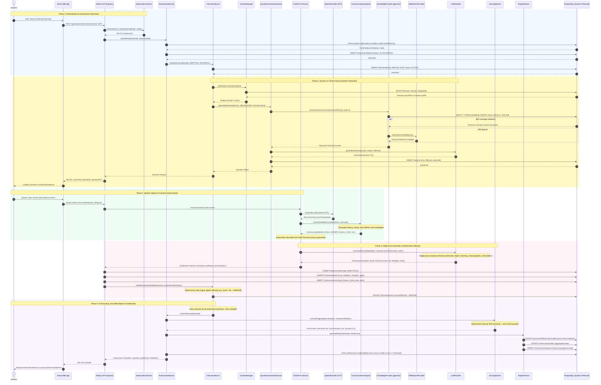

# End-to-End Sequence Diagram — AI Assessment & Evaluation Lifecycle

This diagram illustrates the chronological interaction flow between the student, the client SPA, the Node.js modular monolith services, the FastAPI AI intelligence engine, external providers, and the PostgreSQL persistence layer.

---

