```mermaid
flowchart TB

    %% =========================================================
    %% LAYER 1: PRESENTATION
    %% =========================================================
    subgraph L1["01 · CLIENT / PRESENTATION LAYER (React SPA · HTTPS)"]
        direction TB
        BROWSER["Web Browser (Chrome / Edge / Safari)"]
        
        subgraph SPA["Single React SPA (Role-Scoped UI Views)"]
            direction LR
            subgraph S_VIEWS["Student Views"]
                S_DASH["Student Dashboard"]
                INT_UI["AI Interview UI"]
                LIS_UI["Listening UI"]
                RES_UI["Resume Management"]
                HIST_UI["Assessment History"]
                PERF_UI["Performance Dashboard"]
                REC_UI["Learning Path"]
                CRED_UI["Credit Management"]
            end

            subgraph STAFF_VIEWS["Staff & Admin Views"]
                TR_DASH["Trainer Dashboard"]
                FM_DASH["Mentor Dashboard"]
                ADM_DASH["Program Admin Console"]
                PLC_DASH["Placement Coordinator"]
            end
        end

        BROWSER --> SPA
    end

    %% =========================================================
    %% LAYER 2: CORE APPLICATION LAYER
    %% =========================================================
    subgraph L2["02 · CORE APPLICATION LAYER (Node.js + Express · Modular Monolith)"]
        direction TB
        GW["API Gateway / Express Router (JWT · Rate Limiting · Validation · CORS)"]

        subgraph MODULES["Modular Monolith (15 Core Domain Modules)"]
            direction TB
            subgraph M_ROW1["Identity, Org & Scope"]
                M_AUTH["1. Auth & RBAC"]
                M_USER["2. User & Role Mgmt"]
                M_STUD["3. Student Mgmt"]
                M_PROG["4. Program / Domain / Batch"]
            end

            subgraph M_ROW2["Assessment & Content"]
                M_ASS["5. Assessment Engine"]
                M_INT["6. Interview Orchestrator"]
                M_LIS["7. Listening Module"]
                M_QMGMT["8. Question Mgmt"]
            end

            subgraph M_ROW3["Scoring, Analytics & Readiness"]
                M_EVAL["9. Evaluation Orchestrator"]
                M_PERF["10. Performance Module"]
                M_REP["11. Report Module"]
                M_CRED["12. Credit Module"]
            end

            subgraph M_ROW4["Intelligence & Administration"]
                M_REC["13. Learning Recommendations"]
                M_PLACE["14. Placement Readiness"]
                M_ADM["15. Program Administration"]
            end
        end

        subgraph WORKERS["Background Processing / Job Workers (Optional Async Path)"]
            direction LR
            W_REP["Report Generation"]
            W_AGG["Performance Aggregation"]
            W_REC["Learning Recommendations"]
            W_INGEST["Knowledge Ingestion"]
            W_ANALYTICS["Batch Analytics"]
        end

        GW --> MODULES
        MODULES -.-> WORKERS
    end

    %% =========================================================
    %% LAYER 3: AI / INTELLIGENCE LAYER
    %% =========================================================
    subgraph L3["03 · AI / INTELLIGENCE LAYER (FastAPI · Python · RAG)"]
        direction TB
        
        subgraph SPEECH_PIPE["Speech Processing Pipeline"]
            MIC_IN["Transient Audio Stream"]
            STT_ENG["Speech-to-Text (STT Engine)"]
            TRANSCRIPT["Transcript Generator"]
            COMM_ANA["Communication Analyzer (Fluency, Clarity, Pace, Pitch)"]

            MIC_IN --> STT_ENG --> TRANSCRIPT --> COMM_ANA
        end

        subgraph AI_EVAL["AI Evaluation Service"]
            CTX_BUILD["Context Builder (Resume + Tech KB)"]
            SP_EVAL["Single-Pass LLM Evaluator"]
            EVAL_JSON["Structured Evaluation Result"]

            CTX_BUILD --> SP_EVAL --> EVAL_JSON
        end

        subgraph RAG_PIPE["RAG Knowledge Pipeline"]
            DOCS["Curated Knowledge Docs"]
            CHUNKER["Chunking & Embedding"]
            SEM_SEARCH["Semantic Search (pgvector)"]
            WEB_FALL["Web Search Fallback"]

            DOCS --> CHUNKER --> SEM_SEARCH
            SEM_SEARCH -.->|Fallback if sparse| WEB_FALL
        end
    end

    %% =========================================================
    %% LAYER 4: DATA LAYER
    %% =========================================================
    subgraph L4["04 · DATA LAYER (PostgreSQL · System of Record)"]
        direction TB
        subgraph PG_SCHEMAS["Logical Schemas (Isolated within Single DB)"]
            direction LR
            DB_IAM[("Identity & RBAC")]
            DB_ORG[("Org & Programs")]
            DB_STU[("Students & Resumes")]
            DB_ASS[("Assessments & Attempts")]
            DB_SES[("Sessions & Questions")]
            DB_RES[("Responses & Evaluations")]
            DB_PERF[("Performance & Snapshots")]
            DB_REP[("Reports & Skills")]
            DB_CRED[("Credits & Ledger")]
            DB_VEC[("pgvector Embeddings")]
        end
    end

    %% =========================================================
    %% LAYER 5: EXTERNAL PROVIDERS
    %% =========================================================
    subgraph L5["05 · EXTERNAL PROVIDERS (Interface-Driven & Replaceable)"]
        direction LR
        P_LLM["LLM Provider (Claude / OpenAI / Gemini)"]
        P_STT["Speech-to-Text Provider (Whisper / Deepgram)"]
        P_WEB["Web Search API (Tavily / Serper / Bing)"]
    end

    %% =========================================================
    %% CROSS-CUTTING & SECURITY
    %% =========================================================
    subgraph XCUT["Cross-Cutting Concerns"]
        SEC["Security: HTTPS · JWT · RBAC + Scope · Input Validation · Audit Logs"]
        OBS["Observability: Application Logs · Metrics · Tracing · Error Tracking"]
        DEP["Deployment: Containerized (Docker) · Reverse Proxy / Ingress · Load Balancer"]
    end

    %% =========================================================
    %% INTER-LAYER CONNECTIONS
    %% =========================================================
    SPA -->|HTTPS REST / WebSocket| GW
    MODULES -->|Internal REST / gRPC| L3
    MODULES -->|SQL / Prisma / Drizzle ORM| L4
    L3 -->|Async SQL / pgvector queries| DB_VEC
    L3 -->|Provider Abstraction| P_LLM
    L3 -->|Provider Abstraction| P_STT
    L3 -->|Provider Abstraction| P_WEB

    %% Styling
    classDef l1 fill:#eff6ff,stroke:#2563eb,color:#1e3a8a,stroke-width:2px;
    classDef l2 fill:#f0fdf4,stroke:#16a34a,color:#14532d,stroke-width:2px;
    classDef l3 fill:#fefce8,stroke:#ca8a04,color:#713f12,stroke-width:2px;
    classDef l4 fill:#faf5ff,stroke:#9333ea,color:#581c87,stroke-width:2px;
    classDef l5 fill:#fdf2f8,stroke:#db2777,color:#831843,stroke-width:2px;
    classDef xcut fill:#f1f5f9,stroke:#475569,color:#0f172a,stroke-width:1px;

    class L1 l1;
    class L2 l2;
    class L3 l3;
    class L4 l4;
    class L5 l5;
    class XCUT xcut;
```

# System Architecture — AI-Powered Communication Readiness Platform

## High-Level Architecture Overview
The platform employs a **Modular Monolith + AI Services + RAG** architectural style. 
- **Core Business Logic**: Encapsulated within a well-structured Node.js/Express modular monolith.
- **AI / Speech / Evaluation**: Dedicated high-performance FastAPI (Python) service.
- **System of Record**: PostgreSQL logically partitioned by module schemas, with `pgvector` for semantic knowledge retrieval.
- **Presentation Layer**: Single-Page React Application with role-scoped interfaces.

---

---

## The 15 Core Architecture Principles

| # | Principle | Description |
|---|-----------|-------------|
| **01** | **Modular Monolith for Core Logic** | Core domain logic runs in a centralized Node.js runtime with strict internal module boundaries, avoiding premature microservice complexity. |
| **02** | **Node.js for Business Orchestration** | All state transitions, business rules, credit management, attempt tracking, and scoring calculations reside in Node.js. |
| **03** | **FastAPI / Python for AI & Audio** | Python handles compute-intensive tasks: audio processing, STT coordination, embeddings, and LLM prompt chaining. |
| **04** | **PostgreSQL as Single System of Record** | All operational state, historical reports, user credentials, and configurations live in PostgreSQL. |
| **05** | **pgvector for Native RAG** | Document embeddings and knowledge retrieval live inside the same database engine, eliminating separate vector database infrastructure. |
| **06** | **Provider Abstraction** | Replaceable interfaces for LLM (`LLMProvider`), Speech (`SpeechProvider`), and Search (`WebSearchProvider`) isolate the platform from vendor lock-in. |
| **07** | **Server-Side RBAC + Scope Authorization** | `Authorization = Role + Permission + Scope`. Every request is authorized server-side; UI visibility restrictions are purely cosmetic. |
| **08** | **Single-Pass LLM Evaluation** | A single structured LLM call evaluates technical accuracy, reasoning, depth, misconceptions, and communication alignment in one deterministic JSON schema. |
| **09** | **Immutable Historical Reports** | Assessment reports (`AssessmentReport`) are immutable point-in-time records that never change after submission. |
| **10** | **Performance Profile vs. Snapshots** | `PerformanceProfile` stores current aggregated scores; historical progress is tracked through append-only `PerformanceSnapshot` records. |
| **11** | **Transient Audio Processing** | Raw microphone voice streams are processed in-memory for STT and audio metrics (pitch, pace, clarity) and are **never permanently stored**, respecting student privacy. |
| **12** | **Extensible for Future Modalities** | Architecture seamlessly permits adding video / camera emotion / gaze analysis modules without disrupting existing assessment pipelines. |
| **13** | **No Unnecessary Microservices** | Avoids distributed transaction overhead, network latency, and orchestration failures by keeping domain services in-process. |
| **14** | **No Business Logic in Controllers** | Controllers and route handlers solely validate input, delegate to domain services, and format HTTP responses. |
| **15** | **AI Never Controls Deterministic State** | AI generates content and evaluates responses; deterministic platform code decides difficulty adjustments, credit consumption, and attempt limits. |
