```mermaid
%%{init: {
  "theme": "base",
  "themeVariables": {
    "background": "#f8fafc",
    "primaryColor": "#fff7ed",
    "primaryTextColor": "#111827",
    "primaryBorderColor": "#d1d5db",
    "lineColor": "#6b7280",
    "secondaryColor": "#dcfce7",
    "tertiaryColor": "#ddd6fe"
  }
}}%%

flowchart LR

%% =========================================================
%% ACTORS
%% =========================================================
S([Student])
T([Communication Trainer])
M([Faculty Mentor])
A([Program Administrator])
P([Placement Coordinator])

LLM([LLM / AI Engine])
STT([Speech-to-Text Service])
WEB([Web Search])
RAGDB([RAG / pgvector\nKnowledge Base])

%% =========================================================
%% SYSTEM BOUNDARY
%% =========================================================
subgraph SYS["AI-Powered Communication Readiness Platform"]

    %% -------- AUTH & PROFILE --------
    subgraph AUTH["AUTH & PROFILE"]
        LOGIN(("Sign Up / Login"))
        PROFILE(("Manage Profile"))
        RESUME(("Upload / Manage Resume"))
    end

    %% -------- ASSESSMENT --------
    subgraph ASS["ASSESSMENT"]
        INTERVIEW(("Start AI Interview"))
        ANSWER(("Answer Interview Questions"))
        LISTEN(("Start Listening Assessment"))
        LANSWER(("Answer Listening Questions"))
    end

    %% -------- AI EVALUATION --------
    subgraph EVAL["AI EVALUATION"]
        TECH(("Evaluate Technical Answer"))
        COMM(("Analyze Communication"))
        LISTEN_E(("Evaluate Listening"))
        QUESTION(("Generate Next Question"))
        DIFFICULTY(("Adapt Difficulty"))
        KNOWLEDGE(("Retrieve Knowledge"))
    end

    %% -------- REPORTING --------
    subgraph REPORT["REPORTING & PERFORMANCE"]
        REPORT_VIEW(("View Assessment Report"))
        PERFORMANCE(("View Performance"))
        HISTORY(("View Performance History"))
        TRENDS(("View Performance Trends"))
        SKILLGAP(("View Skill Gaps"))
        LEARNING(("View Learning Recommendations"))
    end

    %% -------- CREDITS --------
    subgraph CREDITS["CREDITS"]
        VIEW_CREDIT(("View Credits"))
        CONSUME(("Consume Credit"))
        EARN(("Earn Performance Credit"))
        CONFIG_CREDIT(("Configure Credit Rules"))
    end

    %% -------- TRAINER --------
    subgraph TRAINER["TRAINER ACCESS"]
        TPROFILE(("View Authorized Student Profiles"))
        TCOMM(("View Communication Results"))
    end

    %% -------- MENTOR --------
    subgraph MENTOR["MENTOR ACCESS"]
        ASSIGNED(("View Assigned Students"))
        MPERF(("View Assigned Performance"))
        MPROGRESS(("Monitor Student Progress"))
    end

    %% -------- PROGRAM ADMIN --------
    subgraph ADMIN["PROGRAM ADMINISTRATION"]
        PSTUDENTS(("View Program Students"))
        PPROFILE(("View Student Profiles"))
        PPERF(("View Student Performance"))
        BBPERF(("View Batch Performance"))
        PROGRAM(("Manage Programs / Domains"))
        BATCH(("Manage Batches"))
        USERS(("Manage Users / Roles"))
        MENTOR_ASSIGN(("Assign Students to Mentors"))
        TRAINER_ASSIGN(("Assign Trainers to Domains"))
    end

    %% -------- PLACEMENT --------
    subgraph PLACEMENT["PLACEMENT OVERSIGHT"]
        IPERF(("View Institution Performance"))
        TOP(("View Top Performers"))
        READINESS(("View Placement Readiness"))
        PREPORT(("View Placement Reports"))
    end

    %% -------- BOUNDED AGENT --------
    subgraph AGENT["BOUNDED LEARNING / READINESS AGENT"]
        AGENT_START(("Analyze Student Readiness"))
        GET_PERF(("Get Student Performance"))
        GET_KNOWLEDGE(("Retrieve Learning Knowledge"))
        GET_GAP(("Get Skill Gap"))
        DRAFT(("Draft Learning Plan"))
        PUBLISH(("Publish Learning Plan"))
    end

end

%% =========================================================
%% STUDENT
%% =========================================================
S --> LOGIN
S --> PROFILE
S --> RESUME
S --> INTERVIEW
S --> ANSWER
S --> LISTEN
S --> LANSWER
S --> VIEW_CREDIT
S --> REPORT_VIEW
S --> PERFORMANCE
S --> HISTORY
S --> TRENDS
S --> SKILLGAP
S --> LEARNING

%% =========================================================
%% TRAINER
%% =========================================================
T --> LOGIN
T --> TPROFILE
T --> TCOMM
T --> PERFORMANCE
T --> TRENDS
T --> REPORT_VIEW

%% =========================================================
%% MENTOR
%% =========================================================
M --> LOGIN
M --> ASSIGNED
M --> MPERF
M --> MPROGRESS
M --> HISTORY
M --> TRENDS
M --> REPORT_VIEW

%% =========================================================
%% PROGRAM ADMIN
%% =========================================================
A --> LOGIN
A --> PSTUDENTS
A --> PPROFILE
A --> PPERF
A --> BBPERF
A --> PROGRAM
A --> BATCH
A --> USERS
A --> MENTOR_ASSIGN
A --> TRAINER_ASSIGN
A --> CONFIG_CREDIT

%% =========================================================
%% PLACEMENT COORDINATOR
%% =========================================================
P --> LOGIN
P --> IPERF
P --> TOP
P --> READINESS
P --> PREPORT
P --> CONFIG_CREDIT

%% =========================================================
%% INTERVIEW FLOW
%% =========================================================
INTERVIEW -.->|<<include>>| CONSUME
ANSWER -.->|<<include>>| TECH
ANSWER -.->|<<include>>| COMM
TECH -.->|<<include>>| DIFFICULTY
COMM -.->|<<include>>| DIFFICULTY
DIFFICULTY -.->|<<include>>| QUESTION
QUESTION -.->|<<include>>| ANSWER
ANSWER -.->|<<extend>>| STT
STT -.-> TECH
STT -.-> COMM
TECH -.-> LLM
COMM -.-> LLM
QUESTION -.-> LLM

%% =========================================================
%% KNOWLEDGE / RAG
%% =========================================================
QUESTION -.->|<<include>>| KNOWLEDGE
KNOWLEDGE -.-> RAGDB
KNOWLEDGE -.->|fallback| WEB
KNOWLEDGE -.-> PERFORMANCE

%% =========================================================
%% LISTENING
%% =========================================================
LISTEN --> LANSWER
LANSWER -.->|<<include>>| LISTEN_E
LISTEN_E -.-> LLM

%% =========================================================
%% PERFORMANCE / REPORTING
%% =========================================================
TECH -.->|<<include>>| PERFORMANCE
COMM -.->|<<include>>| PERFORMANCE
LISTEN_E -.->|<<include>>| PERFORMANCE
PERFORMANCE -.-> HISTORY
PERFORMANCE -.-> TRENDS
PERFORMANCE -.-> REPORT_VIEW
PERFORMANCE -.-> SKILLGAP
SKILLGAP -.->|<<include>>| LEARNING

%% =========================================================
%% CREDITS
%% =========================================================
INTERVIEW -.->|<<include>>| CONSUME
PERFORMANCE -.->|<<extend>>| EARN
CONSUME --> VIEW_CREDIT
EARN --> VIEW_CREDIT

%% =========================================================
%% BOUNDED AGENT
%% =========================================================
PERFORMANCE -.-> AGENT_START
AGENT_START -.-> GET_PERF
AGENT_START -.-> GET_KNOWLEDGE
AGENT_START -.-> GET_GAP
GET_PERF -.-> DRAFT
GET_KNOWLEDGE -.-> DRAFT
GET_GAP -.-> DRAFT
DRAFT -.->|<<include>>| PUBLISH
PUBLISH -.-> LEARNING

%% =========================================================
%% STYLES
%% =========================================================
classDef actor fill:#1e293b,stroke:#cbd5e1,color:#f8fafc,stroke-width:2px;
classDef usecase fill:#fff7ed,stroke:#d97706,color:#111827,stroke-width:1px;
classDef ai fill:#dcfce7,stroke:#16a34a,color:#111827,stroke-width:1px;
classDef external fill:#ddd6fe,stroke:#7c3aed,color:#111827,stroke-width:1px;
classDef agent fill:#dbeafe,stroke:#2563eb,color:#111827,stroke-width:1px;

class S,T,M,A,P actor;
class LLM,STT,WEB,RAGDB external;
class LOGIN,PROFILE,RESUME,INTERVIEW,ANSWER,LISTEN,LANSWER,REPORT_VIEW,PERFORMANCE,HISTORY,TRENDS,SKILLGAP,LEARNING,VIEW_CREDIT,CONSUME,EARN,CONFIG_CREDIT usecase;
class TPROFILE,TCOMM,ASSIGNED,MPERF,MPROGRESS,PSTUDENTS,PPROFILE,PPERF,BBPERF,PROGRAM,BATCH,USERS,MENTOR_ASSIGN,TRAINER_ASSIGN,IPERF,TOP,READINESS,PREPORT usecase;
class TECH,COMM,LISTEN_E,QUESTION,DIFFICULTY,KNOWLEDGE ai;
class AGENT_START,GET_PERF,GET_KNOWLEDGE,GET_GAP,DRAFT,PUBLISH agent;
```

# UML Use Case Diagram — AI-Powered Communication Readiness Platform

This diagram illustrates all actors, use cases, system boundaries, and external system dependencies. It is the primary entry point for understanding **who can do what** on the platform.

---

## Actors

| Actor | Role |
|-------|------|
| **Student** | Undergoes AI-powered interviews, listening assessments, views their own reports, credits, and learning path |
| **Communication Trainer** | Reviews authorized students' communication scores and performance results |
| **Faculty Mentor** | Monitors progress of assigned students, views performance history and trends |
| **Program Administrator** | Manages programs, batches, domains, users/roles, mentor assignments, trainer assignments, and credit rule configuration |
| **Placement Coordinator** | Tracks institution-wide performance, readiness scores, top performers, and placement reports |

## External Systems

| System | Purpose |
|--------|---------|
| **LLM / AI Engine** | Text generation, single-pass structured evaluation |
| **Speech-to-Text Service** | Audio stream transcription |
| **Web Search** | External knowledge retrieval fallback |
| **RAG / pgvector Knowledge Base** | Semantic retrieval from curated internal knowledge corpus |

---



---

## Notes

> **Note A — Department & Mentor Hierarchy:**  
> Department → Faculty Mentor → Assigned Students

> **Note B — Single-Pass Evaluation:**  
> One LLM evaluation call evaluates the response comprehensively across all relevant technical and communication dimensions before returning the structured result.

> **Note C — Knowledge Retrieval:**  
> Knowledge retrieval is used when contextual technical knowledge is required for question generation/evaluation.

> **Note D — Report vs Performance:**  
> Assessment reports are historical snapshots. Performance metrics represent the student's current aggregated state.

> **Note E — RBAC Model:**  
> `User → RoleAssignment → Permission + AccessScope → Resource`  
> Roles are composable: a user may hold multiple roles simultaneously. Permissions are defined independently from roles.

> **Note F — Program Structure:**
> ```
> Institution
> └── Program
>     ├── Domain → Batch
>     └── Configurable Subdivisions
> Department
> └── Faculty Mentor → Assigned Students
> ```
